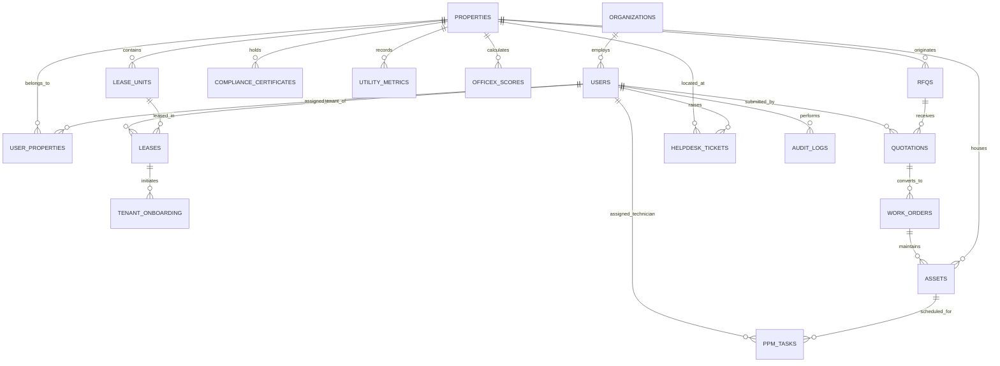
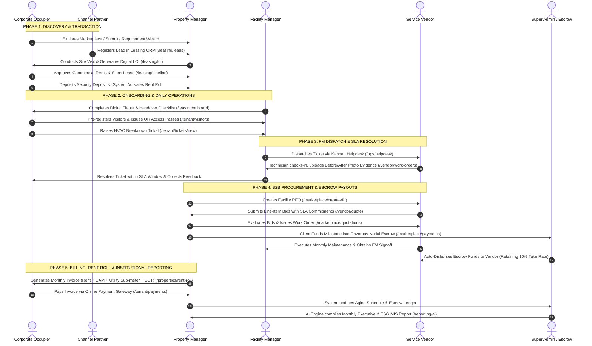

# 🏢 OFFICEX.PRO — Comprehensive Platform Manual & End-to-End Workflow Guide

---

<br/>

## 📋 Document Information & Executive Summary

- **Platform Name:** `OFFICEX.PRO` / Clean Asset Services
- **Document Version:** `4.0 (Master Release)`
- **Document Scope:** Complete Functional Architecture, Portal Manual, Page-by-Page Specifications & Step-by-Step Operational Lifecycles
- **Core Product Mantra:** *Discover • Transact • Operate • Optimize*
- **Architectural Principle:** **ONE Common Platform Core** — A unified master-data foundation interconnecting Marketplace, Commercial Leasing, Property Portfolios, Facility Operations, and Occupier Experience.

<br/>

---

<br/>

## 🌐 Unified Platform Architecture Map

```
+----------------------------------------------------------------------------------------------------+
|                                      OFFICEX.PRO UNIFIED PLATFORM                                  |
+----------------------------------------------------------------------------------------------------+
                                                  │
         ┌────────────────────────┬───────────────┴───────────────┬────────────────────────┐
         │                        │                               │                        │
         ▼                        ▼                               ▼                        ▼
┌──────────────────┐    ┌──────────────────┐            ┌──────────────────┐    ┌──────────────────┐
│  1. MARKETPLACE  │    │ 2. LEASING & CRM │            │ 3. ASSET & PORT. │    │ 4. FM OPERATIONS │
│ • Public Search  │    │ • CRM Pipeline   │            │ • Master Registry│    │ • FM Command Hub │
│ • Map Discovery  │    │ • Lead Triage    │            │ • Rent Roll Core │    │ • Kanban Helpdesk│
│ • 4-Way Compare  │    │ • LOI Generator  │            │ • Collections    │    │ • Asset QR / PPM │
│ • Tour Scheduler │    │ • Broker Payouts │            │ • Aging Sched.   │    │ • SLA Monitor    │
│ • Req. Wizard    │    │ • Onboarding NOC │            │ • Deep Dive View │    │ • EHS Compliance │
└──────────────────┘    └──────────────────┘            └──────────────────┘    └──────────────────┘
         │                        │                               │                        │
         └────────────────────────┼───────────────────────────────┼────────────────────────┘
                                  │                               │
         ┌────────────────────────┴───────────────┬───────────────┴────────────────────────┐
         │                                        │                                        │
         ▼                                        ▼                                        ▼
┌──────────────────┐                    ┌──────────────────┐                    ┌──────────────────┐
│ 5. OCCUPIER EXP  │                    │ 6. VENDOR & PROC │                    │ 7. GOV, ESG & AI │
│ • Tenant Cockpit │                    │ • B2B RFQ Market │                    │ • Super Admin Hub│
│ • Hot Desk Book  │                    │ • Line-Item Bids │                    │ • RBAC Matrix    │
│ • Room Calendar  │                    │ • Escrow Payouts │                    │ • Razorpay Nodal │
│ • QR Passes      │                    │ • Photo Proof    │                    │ • ESG / Utility  │
│ • Razorpay Pay   │                    │ • Work Orders    │                    │ • AI Exec MIS    │
└──────────────────┘                    └──────────────────┘                    └──────────────────┘
```

<br/>

---

<br/>

# 📑 Table of Contents

1. [PART 1: Platform Core Architecture & Security Foundation](#part-1-platform-core-architecture--security-foundation)
   - 1.1 The "One Platform Core" Architecture
   - 1.2 Canonical Entity-Relationship Model
   - 1.3 Role-Based Access Control (RBAC) & User Personas

<br/>

2. [PART 2: Step-by-Step End-to-End Operational Workflows](#part-2-step-by-step-end-to-end-operational-workflows)
   - Flow 1: Workspace Discovery & Public Ingestion
   - Flow 2: Commercial Leasing Pipeline, LOI & Lease Contract
   - Flow 3: Tenant Onboarding, Fit-Out & Handover Gates
   - Flow 4: Daily Occupier Operations & Digital QR Visitor Passes
   - Flow 5: FM Service Request Dispatch & SLA-Governed Resolution
   - Flow 6: Preventive Maintenance (52-Week PPM) & Statutory Compliance
   - Flow 7: B2B Procurement, RFQ Bidding & Work Order Issuance
   - Flow 8: Escrow Milestone Funding & Automated Vendor Payouts
   - Flow 9: Monthly Rent Roll Billing, Escalations & Overdue Collections
   - Flow 10: Institutional Analytics, ESG Sustainability & AI Narrative MIS

<br/>

3. [PART 3: Complete Portal Directory & Page-by-Page Manual (All 76+ Pages)](#part-3-complete-portal-directory--page-by-page-manual)
   - 3.1 Public & Marketplace Portal (`/`, `/public/*`)
   - 3.2 Leasing & CRM Commercial Portal (`/leasing/*`)
   - 3.3 Landlord & Portfolio Properties Portal (`/portfolio`, `/properties/*`, `/property`)
   - 3.4 Facility Management & Operations (FM) Portal (`/ops/*`)
   - 3.5 Tenant & Occupier Experience Portal (`/tenant/*`)
   - 3.6 Vendor & Service Partner Portal (`/vendor/*`)
   - 3.7 Procurement & B2B Marketplace Portal (`/marketplace/*`)
   - 3.8 Reporting, ESG, Utility & AI Analytics Portal (`/reporting/*`, `/reports`)
   - 3.9 Super Admin & Platform Governance Portal (`/admin/*`, `/login`)

<br/>

4. [PART 4: Gap Closures & Business Rules Reference (G-01 to G-20)](#part-4-gap-closures--business-rules-reference)

<br/>

5. [PART 5: Technical Quick Reference & Component Library](#part-5-technical-quick-reference--component-library)

<br/>

---

<br/>

# PART 1: Platform Core Architecture & Security Foundation

<br/>

## 1.1 The "One Platform Core" Architecture

Traditional commercial real estate tools suffer from disconnected silos: separate CRM software, disconnected helpdesk tools, offline Excel rent rolls, and disparate procurement software.

**OFFICEX eliminates this fragmentation through a single canonical database core:**

<br/>

- **Single Sign-On & Universal Identity:**  
  A single user profile can serve as an Asset Manager for Property A, a Tenant Admin for Property B, and an Auditor for Property C without needing multiple accounts.

<br/>

- **Single Source of Truth (Canonical Data Model):**  
  A Property, Unit, Lease, Asset, Ticket, or Vendor is created once in the Core Platform and reused across all 8 modules seamlessly.

<br/>

- **Event-Driven Reactive Automation:**  
  Operational triggers (*LOI Signed*, *SLA Breached*, *Milestone Approved*) immediately notify stakeholders, update status boards, and post financial ledger adjustments in real time.

<br/>

---

<br/>

## 1.2 Canonical Entity-Relationship Model



<br/>

---

<br/>

## 1.3 Role-Based Access Control (RBAC) & User Personas

<br/>

| Role Identifier | Role Title | Core Purpose | Default Landing Page | Scope of Permissions |
| :--- | :--- | :--- | :--- | :--- |
| `super_admin` | **Super Admin** | Platform Governance & Security | `/admin` | Unrestricted full access across all orgs, nodal escrow release, RBAC config, audit trails. |
| `property_manager` | **Property / Asset Manager** | Landlord Portfolio & Commercials | `/portfolio` | Manage property listings, rent rolls, lease expirations, LOI approvals, and revenue rollups. |
| `facility_manager` | **Facility Manager (FM)** | Operations, Maintenance & SLA | `/ops` | FM Command Centre, Kanban ticket dispatch, 52-week PPM scheduling, and utility tracking. |
| `tenant_admin` | **Tenant / Occupier Admin** | Corporate Workspace Management | `/tenant` | View lease contracts, pay rent via Razorpay, invite guests, reserve desks, and raise tickets. |
| `vendor_admin` | **Service Partner / Vendor** | Service Execution & Bidding | `/vendor` | Bid on RFQs, accept Work Orders, submit staff attendance, upload photo proof, track payouts. |
| `broker` | **Channel Partner / Broker** | Lead Generation & Deals | `/leasing` | Register prospective leads, track deal stages, view inventory availability, receive commissions. |
| `auditor` | **Compliance Auditor** | ESG & Statutory Oversight | `/reporting` | Read-only access to compliance certificates, forensic audit logs, ESG data, and financial books. |

<br/>

---

<br/>

# PART 2: Step-by-Step End-to-End Operational Workflows

<br/>



<br/>

---

<br/>

### 📍 Flow 1: Workspace Discovery to Requirement Ingestion

- **Step 1 — Discovery (`/`):**  
  Prospective corporate occupier browses managed offices, bare-shell floors, and coworking spaces on the homepage.

<br/>

- **Step 2 — Search & Geo-Filtering (`/public/search`):**  
  User filters properties by City (Mumbai BKC, Bengaluru ORR), Price/sq.ft., Carpet Area, Building Grade, and Amenities in synced List and Google Map views.

<br/>

- **Step 3 — Multi-Property Benchmark (`/public/property/compare`):**  
  User adds up to 4 shortlisted buildings to compare side-by-side on Rent, CAM, Floor Efficiency, Parking Ratios, and OFFICEX Scores.

<br/>

- **Step 4 — Requirement Wizard Intake (`/public/wizard`):**  
  User fills the 4-step wizard (Company details, seat requirements, operational FM needs, budget).

<br/>

- **Step 5 — Automated Lead Ingestion:**  
  Lead is auto-ingested into `leasingStore` and triggers a real-time event notifying the commercial leasing team.

<br/>

---

<br/>

### 📍 Flow 2: Commercial Leasing Pipeline, LOI & Lease Contract

- **Step 1 — Lead Triage (`/leasing/leads`):**  
  Leasing manager reviews incoming inquiries, qualifies budget, and assigns a dedicated leasing executive.

<br/>

- **Step 2 — Accompanied Property Tour (`/leasing/visits`):**  
  Manager schedules a site visit, generates visitor passes, and logs post-tour client feedback.

<br/>

- **Step 3 — LOI & Term Sheet Generation (`/leasing/loi`):**  
  System calculates Base Rent psf, CAM psf, Escalation Rate (5% per year), Security Deposit (6 months), Lock-in period (36 months), and Fit-out Rent-Free days.

<br/>

- **Step 4 — Pipeline Stage Progression (`/leasing/pipeline`):**  
  Deal moves through Kanban stages (*Enquiry → Qualified → Site Visit → Proposal → LOI Issued → Negotiation → Closed/Leased*).

<br/>

- **Step 5 — Contract Activation:**  
  Upon contract signing and security deposit realization, the lease record is activated and the unit is updated to `leased` in the database.

<br/>

---

<br/>

### 📍 Flow 3: Tenant Onboarding, Fit-Out & Handover Gates

- **Step 1 — Onboarding Initiation (`/leasing/onboard`):**  
  Property Manager initiates the standardized onboarding checklist for the incoming tenant.

<br/>

- **Step 2 — Fit-Out Governance & Contractor NOC:**  
  Tenant uploads architectural drawings, electrical load requirements, and contractor insurance into the Document Locker (`/tenant/documents`).

<br/>

- **Step 3 — Staff Directory & Digital Passes (`/tenant/employee`):**  
  Tenant Admin imports staff roster, configures desk hoteling allocations, and provisions RFID access cards.

<br/>

- **Step 4 — Handover Signoff:**  
  FM and Tenant Admin conduct a joint inspection, record baseline utility meter readings, and complete key handover.

<br/>

---

<br/>

### 📍 Flow 4: Daily Occupier Operations & Digital QR Passes

- **Step 1 — Tenant Cockpit (`/tenant`):**  
  Tenant Admin monitors daily occupancy, open tickets, monthly dues, and scheduled guests.

<br/>

- **Step 2 — Desk & Meeting Room Reservations (`/tenant/employee`):**  
  Employees browse interactive floor plans across Zone A/B/C to reserve hot desks or book conference rooms.

<br/>

- **Step 3 — Visitor Pre-Registration (`/tenant/visitors`):**  
  Host enters visitor details; system generates an encrypted Visitor Pass containing a dynamic QR code.

<br/>

- **Step 4 — Lobby Check-In:**  
  Building security scans the visitor QR code; host receives an instant notification upon guest arrival.

<br/>

---

<br/>

### 📍 Flow 5: FM Service Request Dispatch & SLA Resolution

- **Step 1 — Ticket Creation (`/tenant/tickets/new`):**  
  Tenant logs a service request (e.g., *HVAC Cooling Failure*) with category, priority, and attached photos.

<br/>

- **Step 2 — Dynamic SLA Calculation:**  
  System assigns guaranteed response (e.g., 15 mins) and resolution (e.g., 2 hours) deadlines based on priority.

<br/>

- **Step 3 — FM Kanban Dispatch (`/ops/helpdesk`):**  
  Facility Manager drags the ticket to *Assigned* and dispatches a certified technician or AMC vendor.

<br/>

- **Step 4 — Field Technician Execution (`/vendor/work-orders`):**  
  Technician checks in on-site, executes repairs, and uploads timestamped Before/After photos.

<br/>

- **Step 5 — Tenant Signoff & Rating (`/tenant/helpdesk`):**  
  Tenant confirms resolution, closes the ticket, and submits a 1–5 star rating.

<br/>

---

<br/>

### 📍 Flow 6: Preventive Maintenance (52-Week PPM) & Compliance

- **Step 1 — Asset Registry & QR Tagging (`/ops/assets`):**  
  All electromechanical equipment (Chillers, AHUs, Transformers, Elevators, DG Sets) catalogued with serial codes, warranty dates, and QR badges.

<br/>

- **Step 2 — 52-Week PPM Schedule (`/ops/ppm`):**  
  System auto-generates a 52-week preventive maintenance task calendar.

<br/>

- **Step 3 — Digital Checklist Execution:**  
  Technicians execute digital checklists on mobile, enter sensor readings, and submit signoffs.

<br/>

- **Step 4 — SLA Breach Watch-List (`/ops/sla`):**  
  Real-time monitor flags at-risk maintenance or delayed corrective actions.

<br/>

- **Step 5 — Statutory Compliance Ledger (`/ops/compliance`):**  
  Tracks Fire NOCs, Lift Licenses, Pollution CTOs, and DG permits with 30/60/90-day renewal warnings.

<br/>

---

<br/>

### 📍 Flow 7: B2B Procurement, RFQ Bidding & Work Orders

- **Step 1 — RFQ Publication (`/marketplace/create-rfq`):**  
  Property Manager publishes tender with Scope of Work (SOW), required manpower headcount, and SLA criteria.

<br/>

- **Step 2 — Itemized Vendor Bidding (`/vendor/quote`):**  
  Verified vendors submit itemized line-item quotes (Manpower, Materials, Spares, Overheads + GST) and commit to SLAs.

<br/>

- **Step 3 — Side-by-Side Evaluation (`/marketplace/quotations` & `/marketplace/compare`):**  
  Client compares L1, L2, L3 bids across price, technical qualification, past performance rating, and SLA score.

<br/>

- **Step 4 — Award & Work Order Issuance (`/marketplace/work-orders`):**  
  Client awards bid; system auto-generates legally binding Work Order (`work_orders`) with milestone payment schedules.

<br/>

---

<br/>

### 📍 Flow 8: Escrow Milestone Funding & Automated Payouts

- **Step 1 — Client Escrow Deposit (`/marketplace/payments`):**  
  Client deposits milestone funds into the Razorpay Nodal Escrow Account.

<br/>

- **Step 2 — Execution & Evidence (`/vendor/work-orders`):**  
  Vendor executes milestone tasks, logs biometric staff attendance, and uploads photographic proof.

<br/>

- **Step 3 — FM Inspection Signoff:**  
  Facility Manager inspects completed work on-site and provides digital approval.

<br/>

- **Step 4 — Automated Escrow Disbursement (`/admin/escrow`):**  
  Platform releases funds to the vendor's bank account, auto-deducting the 10% platform take rate and applicable TDS.

<br/>

---

<br/>

### 📍 Flow 9: Monthly Rent Roll Billing, Escalations & Collections

- **Step 1 — Automated Rent Roll Run (`/properties/rent-roll`):**  
  On the 1st of each month, the system calculates Base Rent + CAM charges + Sub-metered Electricity/Water consumption + 18% GST for every leased unit.

<br/>

- **Step 2 — Invoice Dispatch (`/tenant/payments`):**  
  Tax invoices generated with itemized fee breakdown and payment due dates.

<br/>

- **Step 3 — Online Payment Processing (`/tenant/pay`):**  
  Tenant pays via integrated Razorpay gateway (NetBanking, Cards, UPI).

<br/>

- **Step 4 — Aging Dues Tracker (`/properties/collections`):**  
  System tracks collections efficiency and buckets unpaid dues into 0–30, 31–60, 61–90, and 90+ days aging with automated dunning notices.

<br/>

- **Step 5 — Contractual Escalation Alerts:**  
  Alerts Property Manager 60 days prior to contractual rent escalation dates (e.g., 5% every 12 months).

<br/>

---

<br/>

### 📍 Flow 10: Institutional Analytics, ESG & AI Narrative MIS

- **Step 1 — Utility Telemetry Tracking (`/reporting/utilities`):**  
  Continuous monitoring of grid electricity (kWh), DG runtime hours, water consumption (KL), and HVAC efficiency.

<br/>

- **Step 2 — ESG Sustainability Board (`/reporting/esg`):**  
  Calculates carbon footprint, solar offset ratio, rainwater harvesting stats, and green building metrics.

<br/>

- **Step 3 — AI Executive Summary Engine (`/reporting/ai`):**  
  LLM analytics engine synthesizes millions of operational data points across properties into board-ready narrative reports.

<br/>

- **Step 4 — Automated MIS Distribution (`/reporting/mis` & `/reports`):**  
  Auto-schedules consolidated monthly MIS PDF packs delivered directly to institutional landlords and fund managers.

<br/>

- **Step 5 — Forensic Audit Trail (`/admin/audit`):**  
  Every financial, commercial, and operational modification logged with Actor ID, IP Address, Timestamp, and Before/After snapshots.

<br/>

---

<br/>

# PART 3: Complete Portal Directory & Page-by-Page Manual

<br/>

## 3.1 Public & Marketplace Portal

<br/>

---

<br/>

### 🖥️ Page 01: OFFICEX Homepage
> **📍 Route URL:** `/`  
> **🏛️ Portal:** `Public Marketplace`  
> **👥 Target Personas:** `Corporate Tenants` • `Brokers` • `General Public`

<br/>

#### 🎯 1. Primary Purpose & Business Value
- **Why It Exists:** Main customer acquisition gateway and brand showcase for commercial real estate and managed workspaces.
- **Business Value:** Converts organic search traffic and corporate tenants into structured workspace leads.

<br/>

#### 🔄 2. Step-by-Step User Flow
1. **Search Input:** Visitor enters Location (e.g., *Mumbai BKC*), Space Type (*Managed Office*, *Bare Shell*, *Coworking*), and Seat Count in the hero search widget.
2. **Catalog Exploration:** Browses curated sections: *Featured Grade-A Properties*, *Popular Micro-Markets*, *Enterprise Managed Suites*, and *Workplace Services*.
3. **Requirement Intake:** Clicks **Submit Requirements** to launch the interactive workspace wizard.

<br/>

#### 🎛️ 3. Key UI Elements & Interactive Controls
- Global sticky navigation bar with category quick links.
- Hero search filter bar with location and space type dropdowns.
- Interactive property cards showing pricing, sq.ft., and OFFICEX Property Scores.

<br/>

#### 💾 4. Database Entities & System State
- **Tables Queried:** `properties`, `lease_units`, `officex_scores`
- **State Changes:** Read-only public catalog.

<br/>

---

<br/>

### 🖥️ Page 02: Marketplace Search Catalog
> **📍 Route URL:** `/public/search`  
> **🏛️ Portal:** `Public Marketplace`  
> **👥 Target Personas:** `Prospective Tenants` • `Corporate Real Estate Heads` • `Brokers`

<br/>

#### 🎯 1. Primary Purpose & Business Value
- **Why It Exists:** Advanced multi-filter search catalog with synchronized List View and interactive Google Map view.
- **Business Value:** Allows occupiers to pinpoint office spaces matching specific micro-markets, budgets, floor sizes, and technical amenities.

<br/>

#### 🔄 2. Step-by-Step User Flow
1. **View Toggle:** User toggles between List View, Grid View, and Map View.
2. **Filter Application:** Filters by City, Budget Range slider, Floor Area, Building Grade (Grade A/B/C), and Amenities (100% DG, Metro, LEED Gold).
3. **Map Interaction:** Clicks map pins to preview property cards and pricing badges.
4. **Action:** Clicks **View Details** or selects cards for side-by-side comparison.

<br/>

#### 🎛️ 3. Key UI Elements & Interactive Controls
- Multi-faceted sidebar filter (Price slider, Area slider, Grade chips, Amenity checkboxes).
- Real Google Map (`RealGoogleMap.tsx`) with custom price tag markers.
- Sort dropdown: *Recommended*, *Lowest Rent*, *Highest Score*, *Available Soon*.

<br/>

#### 💾 4. Database Entities & System State
- **Tables Queried:** `properties`, `lease_units`, `officex_scores`

<br/>

---

<br/>

### 🖥️ Page 03: Property Detail View
> **📍 Route URL:** `/public/property/[id]`  
> **🏛️ Portal:** `Public Marketplace`  
> **👥 Target Personas:** `Corporate Decision Makers` • `Real Estate Consultants`

<br/>

#### 🎯 1. Primary Purpose & Business Value
- **Why It Exists:** Comprehensive specification sheet for an individual commercial asset.
- **Business Value:** Gives tenants complete transparency into floor layouts, amenities, commercial terms, and operational health before booking inspections.

<br/>

#### 🔄 2. Step-by-Step User Flow
1. **Visual Review:** User browses high-resolution photos and architectural floor plans.
2. **Health Score Audit:** Reviews the **OFFICEX Property Score (0–100)** across Location, Building Quality, Accessibility, Amenities, and ESG Readiness.
3. **Commercial Terms:** Inspects Base Rent psf, CAM charges, Parking allocation, and Escalation %.
4. **Action Trigger:** Clicks **Schedule Site Visit** (opens tour booking modal) or **Request Proposal Pack** (downloads PDF).

<br/>

#### 🎛️ 3. Key UI Elements & Interactive Controls
- Photo gallery lightbox with floor plan zoom.
- Radar chart showing 6-dimension OFFICEX Property Score.
- Sticky transaction sidebar with WhatsApp / Schedule Tour buttons.

<br/>

#### 💾 4. Database Entities & System State
- **Tables Queried:** `properties`, `lease_units`, `officex_scores`, `compliance_certificates`

<br/>

---

<br/>

### 🖥️ Page 04: Multi-Property Comparison
> **📍 Route URL:** `/public/property/compare`  
> **🏛️ Portal:** `Public Marketplace`  
> **👥 Target Personas:** `CFOs` • `Procurement Heads` • `Consultants`

<br/>

#### 🎯 1. Primary Purpose & Business Value
- **Why It Exists:** Side-by-side benchmark comparison matrix for up to 4 selected commercial buildings.
- **Business Value:** Eliminates messy spreadsheets by comparing rental economics, efficiency ratios, and amenities in real time.

<br/>

#### 🔄 2. Step-by-Step User Flow
1. **Property Selection:** User adds 2 to 4 properties from search results.
2. **Comparative Review:** Evaluates Rent/sq.ft., CAM/sq.ft., Monthly Outlay, Floor Efficiency %, Distance to Metro, and Health Score.
3. **Decision Action:** Clicks **Shortlist & Generate LOI** for the selected building.

<br/>

#### 🎛️ 3. Key UI Elements & Interactive Controls
- Sticky property header cards with remove/add buttons.
- Expandable comparison rows (*Commercials*, *Building Specs*, *Operations*, *Connectivity*).

<br/>

#### 💾 4. Database Entities & System State
- **Tables Queried:** `properties`, `lease_units`, `officex_scores`

<br/>

---

<br/>

### 🖥️ Page 05: Workspace Requirement Wizard
> **📍 Route URL:** `/public/wizard`  
> **🏛️ Portal:** `Public Marketplace`  
> **👥 Target Personas:** `Office Managers` • `HR Directors` • `Founders`

<br/>

#### 🎯 1. Primary Purpose & Business Value
- **Why It Exists:** Guided 4-step wizard capturing enterprise workspace requirements.
- **Business Value:** Converts vague inquiries into structured, high-intent lead packages with automated inventory matching.

<br/>

#### 🔄 2. Step-by-Step User Flow
1. **Step 1 (Identity):** Enters Company Name, Entity Type, Industry, GSTIN, and Key Contact.
2. **Step 2 (Space Needs):** Specifies Target City, Micro-market, Model (Managed vs Bare-Shell), Seats, Cabins, and Meeting Rooms.
3. **Step 3 (Commercials & FM):** Selects Monthly Budget, Move-in Timeline, Lease Duration, and required FM services.
4. **Step 4 (Matched Spaces):** Algorithmically matches live vacant units in the portfolio and broadcasts lead to Leasing CRM.

<br/>

#### 🎛️ 3. Key UI Elements & Interactive Controls
- Stepper progress header (1. Identity → 2. Space → 3. FM → 4. Matches).
- Interactive seat and budget sliders.
- Real-time matched unit cards.

<br/>

#### 💾 4. Database Entities & System State
- **State Changes:** Ingests record into `leasingStore` and dispatches `officex-lead-added` event.

<br/>

---

<br/>

### 🖥️ Page 06: Unified Authentication & SSO Portal
> **📍 Route URL:** `/login`  
> **🏛️ Portal:** `Core Security`  
> **👥 Target Personas:** `All Platform Users`

<br/>

#### 🎯 1. Primary Purpose & Business Value
- **Why It Exists:** Secure single entry point with Enterprise SSO and rapid demo role switchers.
- **Business Value:** Enforces secure authentication while allowing instant persona testing.

<br/>

#### 🔄 2. Step-by-Step User Flow
1. **Credentials:** User enters Email/Password or selects Google/Microsoft Enterprise SSO.
2. **Routing:** System validates role (`super_admin`, `property_manager`, `facility_manager`, `tenant_admin`, `vendor_admin`, `broker`, `auditor`) and routes to respective default dashboard.
3. **Demo Switcher:** Includes 1-click demo role switcher pills for rapid UI inspection.

<br/>

#### 🎛️ 3. Key UI Elements & Interactive Controls
- JWT/Supabase authentication form.
- Demo role switcher quick-action buttons.

<br/>

#### 💾 4. Database Entities & System State
- **Tables Queried:** `users`

<br/>

---

<br/>

## 3.2 Leasing & CRM Commercial Portal

<br/>

---

<br/>

### 🖥️ Page 07: Leasing Executive Dashboard
> **📍 Route URL:** `/leasing`  
> **🏛️ Portal:** `Leasing & CRM`  
> **👥 Target Personas:** `Leasing Directors` • `Asset Managers` • `Commercial Heads`

<br/>

#### 🎯 1. Primary Purpose & Business Value
- **Why It Exists:** High-level deal pipeline monitoring, occupancy targets, and conversion funnel tracking.
- **Business Value:** Provides real-time visibility into vacant space absorption and lead bottlenecks.

<br/>

#### 🔄 2. Step-by-Step User Flow
1. **Funnel Review:** Analyzes deal flow: *Enquiry (156) → Qualified (89) → Site Visit (52) → Negotiation (28) → LOI (15) → Closed (8)*.
2. **Live Lead Alert:** Receives real-time public web leads submitted from `/public/wizard`.
3. **Action Items:** Addresses urgent action items (unassigned hot leads, expiring leases).
4. **Daily Tours:** Monitors today's accompanied property tour schedule.

<br/>

#### 🎛️ 3. Key UI Elements & Interactive Controls
- Interactive conversion funnel bars with drill-down links.
- Real-time Public Lead Notification banner.
- Daily Tour Schedule widget with live status chips.

<br/>

#### 💾 4. Database Entities & System State
- **Tables Queried:** `leases`, `lease_units`, `users`, `leasingStore`

<br/>

---

<br/>

### 🖥️ Page 08: Visual CRM Deal Pipeline
> **📍 Route URL:** `/leasing/pipeline`  
> **🏛️ Portal:** `Leasing & CRM`  
> **👥 Target Personas:** `Leasing Executives` • `Commercial Brokers`

<br/>

#### 🎯 1. Primary Purpose & Business Value
- **Why It Exists:** Visual Kanban pipeline tracking commercial negotiations from initial lead to lease signing.
- **Business Value:** Prevents deal slippage and standardizes milestone gates.

<br/>

#### 🔄 2. Step-by-Step User Flow
1. **Pipeline View:** Deals displayed across Kanban columns: *1. New Enquiry*, *2. Qualified*, *3. Site Visit*, *4. Proposal / LOI*, *5. Negotiation*, *6. Closed / Leased*.
2. **Deal Cards:** Each card shows Tenant, Sq.Ft., Deal Value, Broker, and Stage Age.
3. **Stage Move:** Dragging a deal to *Proposal / LOI* opens the LOI generator with pre-filled terms.

<br/>

#### 🎛️ 3. Key UI Elements & Interactive Controls
- Drag-and-drop Kanban board with aggregate stage values (₹ Lakhs).
- Filter by Property, Broker, and Deal Size.

<br/>

#### 💾 4. Database Entities & System State
- **Tables Queried / Updated:** `leases`, `lease_units`, `users`

<br/>

---

<br/>

### 🖥️ Page 09: Inbound Lead Management Directory
> **📍 Route URL:** `/leasing/leads`  
> **🏛️ Portal:** `Leasing & CRM`  
> **👥 Target Personas:** `Inbound Sales` • `Lead Qualification Team`

<br/>

#### 🎯 1. Primary Purpose & Business Value
- **Why It Exists:** Central repository for all inbound leads from web forms, brokers, and phone inquiries.
- **Business Value:** Prevents duplicate leads and enforces first-response SLAs.

<br/>

#### 🔄 2. Step-by-Step User Flow
1. **Lead Triage:** Reviews new leads with budget, seat count, and channel origin.
2. **Assignment:** Assigns lead to a dedicated Leasing Associate.
3. **Status Update:** Updates lead state: *New → Contacted → Qualified → Site Visit Scheduled → Dropped*.

<br/>

#### 🎛️ 3. Key UI Elements & Interactive Controls
- Filter tabs: *All Leads*, *Web Wizard Inquiries*, *Broker Submissions*, *Unassigned*.
- Lead qualification modal with budget and timeline validation.

<br/>

#### 💾 4. Database Entities & System State
- **Tables Queried / Updated:** `leasingStore`, `users`

<br/>

---

<br/>

### 🖥️ Page 10: Site Visit Scheduler & Tour Manager
> **📍 Route URL:** `/leasing/visits`  
> **🏛️ Portal:** `Leasing & CRM`  
> **👥 Target Personas:** `Leasing Officers` • `Relationship Managers` • `Lobby Security`

<br/>

#### 🎯 1. Primary Purpose & Business Value
- **Why It Exists:** Calendar and log for scheduling and conducting accompanied property walkthroughs.
- **Business Value:** Streamlines security clearance for prospective tenants and captures inspection feedback instantly.

<br/>

#### 🔄 2. Step-by-Step User Flow
1. **Schedule Tour:** Manager selects Property, Date, Slot, Client Name, and Visitor Count.
2. **Pass Generation:** System auto-generates visitor entry passes.
3. **Feedback Logging:** After the tour, manager logs client ratings and comments.

<br/>

#### 🎛️ 3. Key UI Elements & Interactive Controls
- Calendar and Agenda view of scheduled visits.
- Post-visit feedback form with scoring criteria.

<br/>

#### 💾 4. Database Entities & System State
- **Tables Queried / Updated:** `properties`, `users`, `leases`

<br/>

---

<br/>

### 🖥️ Page 11: Digital LOI & Term Sheet Generator
> **📍 Route URL:** `/leasing/loi`  
> **🏛️ Portal:** `Leasing & CRM`  
> **👥 Target Personas:** `Commercial Directors` • `Legal Counsel` • `Asset Managers`

<br/>

#### 🎯 1. Primary Purpose & Business Value
- **Why It Exists:** Formulates institutional-grade Letter of Intent (LOI) proposals.
- **Business Value:** Standardizes commercial calculations and automates term sheet generation.

<br/>

#### 🔄 2. Step-by-Step User Flow
1. **Parameter Input:** Selects Tenant, Property, and Lease Unit.
2. **Commercial Config:** Configures Base Rent psf, CAM psf, Escalation % (5%), Deposit months (6), Lock-in (36 months), and Fit-out Rent-Free days.
3. **Live Preview:** Renders real-time legal document preview.
4. **Signoff Trigger:** Clicks **Send LOI for Digital Signoff**.

<br/>

#### 🎛️ 3. Key UI Elements & Interactive Controls
- Parameter input sliders.
- Live paper-style LOI document preview.
- Export as PDF / Send for E-Signature actions.

<br/>

#### 💾 4. Database Entities & System State
- **Tables Queried / Updated:** `leases`, `lease_units`, `properties`, `users`

<br/>

---

<br/>

### 🖥️ Page 12: Space Vacancy & Listings Manager
> **📍 Route URL:** `/leasing/listings`  
> **🏛️ Portal:** `Leasing & CRM`  
> **👥 Target Personas:** `Inventory Managers` • `Listing Coordinators`

<br/>

#### 🎯 1. Primary Purpose & Business Value
- **Why It Exists:** Manages inventory availability, floor-wise vacancy, and marketing readiness.
- **Business Value:** Ensures real-time accuracy of available inventory across the portfolio.

<br/>

#### 🔄 2. Step-by-Step User Flow
1. **Inventory Review:** Grid view of all units across buildings with Status (*Available*, *Under Offer*, *Occupied*).
2. **Publishing:** 1-click publishing or unpublishing of vacant units to the public marketplace.

<br/>

#### 🎛️ 3. Key UI Elements & Interactive Controls
- Floor-by-floor occupancy visualizer.
- Bulk pricing update actions.

<br/>

#### 💾 4. Database Entities & System State
- **Tables Queried / Updated:** `lease_units`, `properties`

<br/>

---

<br/>

### 🖥️ Page 13: Master Space & Lease Registry
> **📍 Route URL:** `/leasing/registry`  
> **🏛️ Portal:** `Leasing & CRM`  
> **👥 Target Personas:** `Portfolio Auditors` • `Asset Managers`

<br/>

#### 🎯 1. Primary Purpose & Business Value
- **Why It Exists:** Canonical registry of physical spaces, super built-up areas, carpet areas, and historical tenancies.
- **Business Value:** Single source of truth for architectural spatial data and historical lease agreements.

<br/>

#### 🔄 2. Step-by-Step User Flow
1. **Search:** Searches by Unit ID, Floor, or Tenant Name.
2. **History Audit:** Views historical occupancy timeline, rental yields, and structural modifications.

<br/>

#### 🎛️ 3. Key UI Elements & Interactive Controls
- Search and column sorting.
- Side-drawer with historical lease timeline.

<br/>

#### 💾 4. Database Entities & System State
- **Tables Queried:** `lease_units`, `leases`, `properties`

<br/>

---

<br/>

### 🖥️ Page 14: Broker Commissions & Payouts Ledger
> **📍 Route URL:** `/leasing/commissions`  
> **🏛️ Portal:** `Leasing & CRM`  
> **👥 Target Personas:** `Channel Partner Heads` • `Finance Managers` • `Brokers`

<br/>

#### 🎯 1. Primary Purpose & Business Value
- **Why It Exists:** Calculates, approves, and tracks broker commission payouts for closed transactions.
- **Business Value:** Eliminates broker disputes and ties payouts directly to lease deposit realization.

<br/>

#### 🔄 2. Step-by-Step User Flow
1. **Deal Attribution:** Reviews closed transactions attributed to external brokers.
2. **Validation:** Verifies security deposit realization before releasing commission approval.
3. **Disbursement:** Dispatches payout via Finance/Escrow module.

<br/>

#### 🎛️ 3. Key UI Elements & Interactive Controls
- Commission ledger with status chips (*Pending Verification*, *Deposit Cleared*, *Paid*).
- Broker performance leaderboard.

<br/>

#### 💾 4. Database Entities & System State
- **Tables Queried / Updated:** `leases`, `users`

<br/>

---

<br/>

### 🖥️ Page 15: Tenant Onboarding & Fit-Out Wizard
> **📍 Route URL:** `/leasing/onboard`  
> **🏛️ Portal:** `Leasing & CRM`  
> **👥 Target Personas:** `Onboarding Specialists` • `Facility Managers` • `Tenant Admins`

<br/>

#### 🎯 1. Primary Purpose & Business Value
- **Why It Exists:** Manages post-signing transition, fit-out approvals, and operational handover.
- **Business Value:** Prevents move-in delays and ensures all compliance documents and deposits are cleared before handover.

<br/>

#### 🔄 2. Step-by-Step User Flow
1. **Gate 1:** Security Deposit & First Month Rent Realization.
2. **Gate 2:** Tenant KYC & Certificate of Incorporation verification.
3. **Gate 3:** Fit-out drawings approval & Contractor insurance submission.
4. **Gate 4:** Baseline utility meter readings recorded.
5. **Gate 5:** Access cards issued and keys handed over → lease activated in Rent Roll.

<br/>

#### 🎛️ 3. Key UI Elements & Interactive Controls
- 5-Gate milestone checklist with document upload slots and approval toggles.
- Fit-out countdown timer.

<br/>

#### 💾 4. Database Entities & System State
- **Tables Queried / Updated:** `tenant_onboarding`, `leases`, `users`

<br/>

---

<br/>

### 🖥️ Page 16: In-App Lead & Broker Chat Hub
> **📍 Route URL:** `/leasing/chat`  
> **🏛️ Portal:** `Leasing & CRM`  
> **👥 Target Personas:** `Leasing Executives` • `Brokers` • `Prospective Tenants`

<br/>

#### 🎯 1. Primary Purpose & Business Value
- **Why It Exists:** Real-time messaging hub connecting leasing managers with prospective clients and brokers.
- **Business Value:** Accelerates negotiations and archives all correspondence with the deal file.

<br/>

#### 🔄 2. Step-by-Step User Flow
1. **Chat Select:** Selects active deal conversation.
2. **Exchange:** Sends messages, floor plans, revised term sheets, and tour invites.

<br/>

#### 🎛️ 3. Key UI Elements & Interactive Controls
- Split-screen chat interface with deal context summary card.
- Quick-reply templates.

<br/>

#### 💾 4. Database Entities & System State
- **Tables Queried / Updated:** `users`, `leases`

<br/>

---

<br/>

## 3.3 Landlord & Portfolio Properties Portal

<br/>

---

<br/>

### 🖥️ Page 17: Executive Portfolio Dashboard
> **📍 Route URL:** `/portfolio`  
> **🏛️ Portal:** `Landlord Portfolio`  
> **👥 Target Personas:** `Asset Managers` • `Fund Managers` • `Property Owners`

<br/>

#### 🎯 1. Primary Purpose & Business Value
- **Why It Exists:** Macro-level executive dashboard aggregating financial, operational, and occupancy KPIs across an entire institutional real estate portfolio.
- **Business Value:** Enables asset owners to monitor total portfolio value, rental yields, collection efficiency, and lease expiry cliffs.

<br/>

#### 🔄 2. Step-by-Step User Flow
1. **Macro KPI Audit:** Reviews Leasable Area (2.4M sq.ft.), Occupancy (94.2%), Monthly Gross Rent (₹18.4 Cr), Collection Efficiency (98.6%), and Portfolio OFFICEX Score (91/100).
2. **Geographic Distribution:** Inspects property clusters on interactive map.
3. **Risk Analysis:** Reviews 12-month lease expiry risk chart.

<br/>

#### 🎛️ 3. Key UI Elements & Interactive Controls
- Macro KPI cards with trend sparklines.
- Interactive multi-city property map.
- Lease Expiry Cliff chart.

<br/>

#### 💾 4. Database Entities & System State
- **Tables Queried:** `properties`, `leases`, `officex_scores`

<br/>

---

<br/>

### 🖥️ Page 18: Properties Master Directory
> **📍 Route URL:** `/properties`  
> **🏛️ Portal:** `Landlord Portfolio`  
> **👥 Target Personas:** `Asset Managers` • `Property Administrators`

<br/>

#### 🎯 1. Primary Purpose & Business Value
- **Why It Exists:** Visual directory of all commercial buildings owned or managed.
- **Business Value:** Central catalog for asset managers to inspect building grade, total occupied area, operational costs, and tenant count.

<br/>

#### 🔄 2. Step-by-Step User Flow
1. **View & Filter:** Toggles Grid/Table view; filters by City, Grade, or Occupancy Range.
2. **Property Inspection:** Clicks building card to view operational breakdown or edit specs.

<br/>

#### 🎛️ 3. Key UI Elements & Interactive Controls
- Building card grid with occupancy progress bar and health score badge.
- Quick filter toolbar.

<br/>

#### 💾 4. Database Entities & System State
- **Tables Queried:** `properties`, `lease_units`, `leases`

<br/>

---

<br/>

### 🖥️ Page 19: Rent Roll Master Engine
> **📍 Route URL:** `/properties/rent-roll`  
> **🏛️ Portal:** `Landlord Portfolio`  
> **👥 Target Personas:** `CFOs` • `Leasing Directors` • `Property Accountants`

<br/>

#### 🎯 1. Primary Purpose & Business Value
- **Why It Exists:** Institutional-grade Rent Roll engine governing all lease financials, monthly billing, contractual escalations, and lock-in covenants.
- **Business Value:** Automates complex rent, CAM, parking, and utility calculations while eliminating spreadsheet errors.

<br/>

#### 🔄 2. Step-by-Step User Flow
1. **Cycle Selection:** Selects Property and Billing Cycle.
2. **Sub-View Navigation:**
   - **Rent Roll Grid:** Tenant, Unit, Leased Sq.Ft., Lease Dates, Base Rent psf, Current Rent, CAM psf, Utilities, 18% GST, Total Monthly Billing, Deposit Held, Overdue Balance.
   - **Invoices Tab:** View, approve, and bulk-dispatch tax invoices.
   - **Collections & Aging Tab:** Monitor paid vs. unpaid dues.
   - **Escalation Schedule:** 12-month forward look of upcoming contractual rent escalations.
   - **P&L / NOI Rollup:** Net Operating Income calculation.
   - **Dictionary:** CRE metric formulas and definitions.
3. **Row Expansion:** Expands any tenant row to inspect granular milestones.

<br/>

#### 🎛️ 3. Key UI Elements & Interactive Controls
- Multi-tab navigation (*Rent Roll*, *Invoices*, *Collections*, *Aging*, *Escalations*, *P&L*, *Dictionary*).
- Search and Export to Excel / PDF actions.

<br/>

#### 💾 4. Database Entities & System State
- **Tables Queried / Updated:** `leases`, `lease_units`, `properties`, `users`

<br/>

---

<br/>

### 🖥️ Page 20: Collections & Aging Dues Tracker
> **📍 Route URL:** `/properties/collections`  
> **🏛️ Portal:** `Landlord Portfolio`  
> **👥 Target Personas:** `Credit Control Teams` • `Property Accountants`

<br/>

#### 🎯 1. Primary Purpose & Business Value
- **Why It Exists:** Financial ledger tracking payment receipts, outstanding balances, and delinquent accounts.
- **Business Value:** Minimizes Days Sales Outstanding (DSO) and enforces automated dunning.

<br/>

#### 🔄 2. Step-by-Step User Flow
1. **Summary Audit:** Reviews Total Invoiced, Total Collected, Total Overdue, and DSO.
2. **Bucket Analysis:** Reviews aging buckets: *Current (0–30)*, *Overdue (31–60)*, *Delinquent (61–90)*, *Critical (90+ Days)*.
3. **Dunning Action:** Clicks **Send Payment Reminder** (sends payment link).

<br/>

#### 🎛️ 3. Key UI Elements & Interactive Controls
- Aging bucket distribution cards.
- Delinquency table with 1-click dunning triggers.

<br/>

#### 💾 4. Database Entities & System State
- **Tables Queried / Updated:** `leases`, `users`

<br/>

---

<br/>

### 🖥️ Page 21: Occupier Master Directory
> **📍 Route URL:** `/properties/tenants`  
> **🏛️ Portal:** `Landlord Portfolio`  
> **👥 Target Personas:** `Tenant Relationship Managers` • `Asset Managers`

<br/>

#### 🎯 1. Primary Purpose & Business Value
- **Why It Exists:** Master directory of all corporate occupiers with key business contacts and lease summaries.
- **Business Value:** Centralizes relationship management, parent entity tracking, and emergency contacts.

<br/>

#### 🔄 2. Step-by-Step User Flow
1. **Search:** Searches by Company Name or Industry.
2. **Profile Review:** Views leased units, headcount, active contracts, monthly billing, and ticket history.

<br/>

#### 🎛️ 3. Key UI Elements & Interactive Controls
- Search bar, Industry filter, and Tenant Health status badge.

<br/>

#### 💾 4. Database Entities & System State
- **Tables Queried:** `users`, `leases`, `properties`

<br/>

---

<br/>

### 🖥️ Page 22: Property Statutory Compliance Matrix
> **📍 Route URL:** `/properties/compliance`  
> **🏛️ Portal:** `Landlord Portfolio`  
> **👥 Target Personas:** `Statutory Compliance Officers` • `Facility Directors`

<br/>

#### 🎯 1. Primary Purpose & Business Value
- **Why It Exists:** Centralized compliance scorecard for statutory licenses, building approvals, and environmental permits.
- **Business Value:** Eliminates building shutdown risks and insurance invalidation caused by expired statutory licenses.

<br/>

#### 🔄 2. Step-by-Step User Flow
1. **Audit:** Reviews Fire Safety NOC, Lift Licenses, Pollution CTO, and DG Permits.
2. **Renewal:** Inspects expiry countdowns and uploads renewed certificates.

<br/>

#### 🎛️ 3. Key UI Elements & Interactive Controls
- Compliance Status donut chart.
- License card grid with document viewer and renewal alert banners.

<br/>

#### 💾 4. Database Entities & System State
- **Tables Queried / Updated:** `compliance_certificates`, `properties`

<br/>

---

<br/>

### 🖥️ Page 23: Canonical Asset Master Registry
> **📍 Route URL:** `/properties/registry`  
> **🏛️ Portal:** `Landlord Portfolio`  
> **👥 Target Personas:** `Legal Counsel` • `Investment Bankers` • `Asset Managers`

<br/>

#### 🎯 1. Primary Purpose & Business Value
- **Why It Exists:** Documented repository of building title deeds, sanctioned plans, and occupancy certificates (OC).
- **Business Value:** Provides an auditable virtual data room for due diligence.

<br/>

#### 🔄 2. Step-by-Step User Flow
1. **Folder Access:** Opens master documentation locker for a selected property.
2. **Download:** Downloads sanctioned layouts, electrical SLD drawings, and structural approvals.

<br/>

#### 🎛️ 3. Key UI Elements & Interactive Controls
- Categorized folder structure (*Legal*, *Drawings*, *Sanctions*, *MEP*).

<br/>

#### 💾 4. Database Entities & System State
- **Tables Queried:** `properties`

<br/>

---

<br/>

### 🖥️ Page 24: Single Property Performance Deep Dive
> **📍 Route URL:** `/property`  
> **🏛️ Portal:** `Landlord Portfolio`  
> **👥 Target Personas:** `Building General Managers` • `Operations Heads`

<br/>

#### 🎯 1. Primary Purpose & Business Value
- **Why It Exists:** Dedicated 360-degree operational and commercial dashboard for an individual building.
- **Business Value:** Deep dive into a single asset's occupancy, revenue, energy consumption, and FM score.

<br/>

#### 🔄 2. Step-by-Step User Flow
1. **Asset Switch:** Selects building (e.g., *Apex Business Tower*).
2. **KPI Audit:** Reviews Occupancy %, Revenue, Open Tickets, Energy Intensity (kWh/sq.ft.), and OFFICEX Health Score.

<br/>

#### 🎛️ 3. Key UI Elements & Interactive Controls
- Building switcher dropdown and 360-degree KPI grid.

<br/>

#### 💾 4. Database Entities & System State
- **Tables Queried:** `properties`, `leases`, `helpdesk_tickets`, `officex_scores`

<br/>

---

<br/>

## 3.4 Facility Management & Operations (FM) Portal

<br/>

---

<br/>

### 🖥️ Page 25: FM Command Centre & Workplace Health Score
> **📍 Route URL:** `/ops`  
> **🏛️ Portal:** `FM Operations`  
> **👥 Target Personas:** `Facility Directors` • `Operations Managers` • `Duty Engineers`

<br/>

#### 🎯 1. Primary Purpose & Business Value
- **Why It Exists:** Central operational command center monitoring real-time building performance, active incidents, and the **Workplace Health Score (91/100)**.
- **Business Value:** Shifts facility operations from reactive firefighting to proactive, data-driven management.

<br/>

#### 🔄 2. Step-by-Step User Flow
1. **Health Score Audit:** Reviews North Star **Workplace Health Score (0–100)** across Space, Facility, Assets, People, Cost, Energy, Vendors, and Experience.
2. **Exception Triage:** Reviews categorized exceptions:
   - **Critical (Red):** Equipment breakdowns or breached tickets.
   - **At Risk (Amber):** Tickets approaching SLA breach (<30 mins remaining).
   - **Normal (Green):** Stable operational parameters.
3. **Dispatch:** Clicks any exception to execute immediate dispatch.

<br/>

#### 🎛️ 3. Key UI Elements & Interactive Controls
- Workplace Health Score gauge with 8 dimensional score bars.
- Live Exception Feed with instant action triggers.
- Quick KPI chips (Open Issues, Uptime %, SLA %, Energy Efficiency).

<br/>

#### 💾 4. Database Entities & System State
- **Tables Queried:** `officex_scores`, `helpdesk_tickets`, `assets`, `ppm_tasks`

<br/>

---

<br/>

### 🖥️ Page 26: Kanban Helpdesk Command Centre
> **📍 Route URL:** `/ops/helpdesk`  
> **🏛️ Portal:** `FM Operations`  
> **👥 Target Personas:** `Helpdesk Coordinators` • `Facility Executives` • `Technicians`

<br/>

#### 🎯 1. Primary Purpose & Business Value
- **Why It Exists:** Drag-and-drop Kanban service desk for triaging, dispatching, and resolving facility service requests.
- **Business Value:** Enforces structured ticket lifecycles and provides real-time SLA countdown visibility.

<br/>

#### 🔄 2. Step-by-Step User Flow
1. **Kanban Columns:** Displays tickets across: *1. New (Unassigned)*, *2. Assigned*, *3. In Progress*, *4. Resolved*.
2. **Card Info:** Cards show Category, Priority, Tenant, Location, Assigned Vendor, and Live Dynamic SLA Timer.
3. **Dispatch:** Drags card to *Assigned* → selects technician → notifies technician mobile app.
4. **Resolution:** Technician attaches completion photos and moves card to *Resolved*.

<br/>

#### 🎛️ 3. Key UI Elements & Interactive Controls
- Kanban columns with ticket count badges.
- Dynamic SLA Countdown Timer with color states (*Green → Amber → Red*).
- Filter by Category, Property, Priority, and Vendor.

<br/>

#### 💾 4. Database Entities & System State
- **Tables Queried / Updated:** `helpdesk_tickets`, `users`, `properties`

<br/>

---

<br/>

### 🖥️ Page 27: Asset Management Register & QR Profiles
> **📍 Route URL:** `/ops/assets`  
> **🏛️ Portal:** `FM Operations`  
> **👥 Target Personas:** `Chief Engineers` • `Technical Supervisors` • `Technicians`

<br/>

#### 🎯 1. Primary Purpose & Business Value
- **Why It Exists:** Canonical registry of all physical, mechanical, and electrical assets with maintenance histories and QR code workflows.
- **Business Value:** Prolongs equipment lifespans and provides instant on-site equipment history via QR scanning.

<br/>

#### 🔄 2. Step-by-Step User Flow
1. **Search & Filter:** Filters assets by Category (HVAC, Electrical, Elevators, Fire), Location, Criticality, and Warranty.
2. **Profile View:** Clicks asset to inspect Serial Number, Commissioning Date, AMC Vendor, Past Breakdowns, and Next PPM.
3. **QR Generation:** Clicks **Generate QR Code** to print waterproof asset tag for physical machinery.

<br/>

#### 🎛️ 3. Key UI Elements & Interactive Controls
- Asset table with Health Score chips, Status, and Warranty badges.
- Asset Detail modal with maintenance timeline and QR code downloader.

<br/>

#### 💾 4. Database Entities & System State
- **Tables Queried / Updated:** `assets`, `users`, `properties`, `ppm_tasks`

<br/>

---

<br/>

### 🖥️ Page 28: 52-Week Planned Preventive Maintenance (PPM)
> **📍 Route URL:** `/ops/ppm`  
> **🏛️ Portal:** `FM Operations`  
> **👥 Target Personas:** `MEP Supervisors` • `Operations Engineers` • `AMC Vendors`

<br/>

#### 🎯 1. Primary Purpose & Business Value
- **Why It Exists:** Comprehensive calendar and task engine for scheduling, executing, and auditing recurring preventive maintenance.
- **Business Value:** Prevents catastrophic breakdowns by enforcing scheduled servicing.

<br/>

#### 🔄 2. Step-by-Step User Flow
1. **Matrix Review:** Displays 52-week maintenance matrix organized by Week, Category, and Assigned Vendor.
2. **Task Execution:** Technician opens task (e.g., *Week 36: Transformer Oil Filtration*), completes checklist items, and submits numerical readings.
3. **Signoff:** Supervisor reviews checklist and signs off.

<br/>

#### 🎛️ 3. Key UI Elements & Interactive Controls
- 52-Week visual calendar grid.
- Digital checklist modal with checkbox items and numerical input fields.
- Filter by Week, Asset, and Status.

<br/>

#### 💾 4. Database Entities & System State
- **Tables Queried / Updated:** `ppm_tasks`, `assets`, `users`

<br/>

---

<br/>

### 🖥️ Page 29: SLA Monitoring & Breach Center
> **📍 Route URL:** `/ops/sla`  
> **🏛️ Portal:** `FM Operations`  
> **👥 Target Personas:** `Service Quality Managers` • `FM Directors` • `Auditors`

<br/>

#### 🎯 1. Primary Purpose & Business Value
- **Why It Exists:** Real-time compliance dashboard tracking response and resolution SLAs across internal teams and external vendors.
- **Business Value:** Prevents client dissatisfaction and calculates contractual penalty deductions for vendor SLA breaches.

<br/>

#### 🔄 2. Step-by-Step User Flow
1. **Compliance Rate:** Displays overall SLA compliance rate (e.g., 94.8%).
2. **At-Risk Watch-list:** Flags tickets in danger of breaching within 30 minutes.
3. **Breach Log:** Records Root Cause, Breach Duration, Responsible Vendor, and Penalty Deductions.

<br/>

#### 🎛️ 3. Key UI Elements & Interactive Controls
- Real-time SLA breach gauge.
- Active countdown watch-list.
- Vendor-wise SLA compliance leaderboard.

<br/>

#### 💾 4. Database Entities & System State
- **Tables Queried:** `helpdesk_tickets`, `quotations`, `work_orders`

<br/>

---

<br/>

### 🖥️ Page 30: Statutory & EHS Compliance Tracker
> **📍 Route URL:** `/ops/compliance`  
> **🏛️ Portal:** `FM Operations`  
> **👥 Target Personas:** `EHS Officers` • `Building Operations Leads`

<br/>

#### 🎯 1. Primary Purpose & Business Value
- **Why It Exists:** Operational tracking of Environmental Health and Safety (EHS) audits, fire drills, water quality tests, and safety compliance.
- **Business Value:** Ensures workplace safety and zero legal violations.

<br/>

#### 🔄 2. Step-by-Step User Flow
1. **Schedules:** Monitors safety schedules (Fire Drill, Water Testing, DG Emissions).
2. **Logging:** Logs test results, inspection observations, and Corrective Action Plans (CAPA).

<br/>

#### 🎛️ 3. Key UI Elements & Interactive Controls
- Compliance calendar and expiry status pills.
- Document upload and verification workflow.

<br/>

#### 💾 4. Database Entities & System State
- **Tables Queried / Updated:** `compliance_certificates`, `properties`

<br/>

---

<br/>

### 🖥️ Page 31: Service Contracts & AMC Management
> **📍 Route URL:** `/ops/contracts`  
> **🏛️ Portal:** `FM Operations`  
> **👥 Target Personas:** `Contracts Managers` • `Procurement Leads`

<br/>

#### 🎯 1. Primary Purpose & Business Value
- **Why It Exists:** Central directory for managing all Annual Maintenance Contracts (AMC) and service level agreements.
- **Business Value:** Prevents unauthorized work, tracks renewal dates, and maintains vendor accountability.

<br/>

#### 🔄 2. Step-by-Step User Flow
1. **Contract List:** Displays active contracts (Chiller AMC, Elevators, Housekeeping, Security).
2. **Renewal:** Generates renewal alerts 60 days before contract expiry.

<br/>

#### 🎛️ 3. Key UI Elements & Interactive Controls
- Contract cards with Scope of Work summary and renewal countdown.
- Digital contract document viewer.

<br/>

#### 💾 4. Database Entities & System State
- **Tables Queried / Updated:** `work_orders`, `users`, `properties`

<br/>

---

<br/>

### 🖥️ Page 32: Workforce Shifts & Biometric Attendance
> **📍 Route URL:** `/ops/attendance`  
> **🏛️ Portal:** `FM Operations`  
> **👥 Target Personas:** `Security Officers` • `Soft Services Supervisors`

<br/>

#### 🎯 1. Primary Purpose & Business Value
- **Why It Exists:** Tracks daily deployment, shift rosters, and biometric attendance of outsourced security and housekeeping personnel.
- **Business Value:** Eliminates ghost manpower billing and ensures required guard headcounts are present on site.

<br/>

#### 🔄 2. Step-by-Step User Flow
1. **Headcount Check:** Reviews Planned Headcount vs. Actual Biometric Punch-Ins.
2. **Deductions:** Highlights shift deficits and auto-computes deductions on vendor invoices.

<br/>

#### 🎛️ 3. Key UI Elements & Interactive Controls
- Shift roster table (Morning, Evening, Night).
- Manpower deficit alerts and attendance realization percentages.

<br/>

#### 💾 4. Database Entities & System State
- **Tables Queried:** `users`, `work_orders`

<br/>

---

<br/>

### 🖥️ Page 33: Live Operational Activity Feed
> **📍 Route URL:** `/ops/activity`  
> **🏛️ Portal:** `FM Operations`  
> **👥 Target Personas:** `Operations Managers` • `Control Room Operators`

<br/>

#### 🎯 1. Primary Purpose & Business Value
- **Why It Exists:** Real-time unified audit feed of all operational events taking place across properties.
- **Business Value:** Gives facility leadership immediate situational awareness of incidents, technician check-ins, and system triggers.

<br/>

#### 🔄 2. Step-by-Step User Flow
1. **Live Stream:** Displays streaming event cards: *Ticket #1042 Assigned*, *PPM Week 36 Done on AHU-02*, *Visitor QR Scanned*, *Fire NOC Renewal Alert*.
2. **Drill Down:** Clicks any event to navigate directly to the underlying record.

<br/>

#### 🎛️ 3. Key UI Elements & Interactive Controls
- Filter by Event Type and Severity (*Info*, *Warning*, *Critical*).

<br/>

#### 💾 4. Database Entities & System State
- **Tables Queried:** `audit_logs`, `helpdesk_tickets`, `ppm_tasks`

<br/>

---

<br/>

### 🖥️ Page 34: Outcome-Based FM Performance Dashboard
> **📍 Route URL:** `/ops/outcomes`  
> **🏛️ Portal:** `FM Operations`  
> **👥 Target Personas:** `Workplace Experience Heads` • `Facility Directors`

<br/>

#### 🎯 1. Primary Purpose & Business Value
- **Why It Exists:** Evaluates facility management based on qualitative and quantitative workplace outcomes rather than mere headcount.
- **Business Value:** Standardizes service delivery evaluation by measuring Cleanliness, Comfort, Availability, and User NPS.

<br/>

#### 🔄 2. Step-by-Step User Flow
1. **Outcome Score Audit:** Reviews **FM Outcome Score (91/100)** across:
   - Cleanliness Score (94/95)
   - Comfort Score (88/90)
   - Asset Availability (96/98)
   - Service Quality (91/90)
   - SLA Compliance (89/95)
   - Experience Rating (92/90)
2. **Unit Economics:** Inspects Cost/sq.ft. (₹18.5), Cost/Seat (₹1,240), Energy/sq.ft. (₹4.2), and Ticket Recurrence Rate (4.2%).

<br/>

#### 🎛️ 3. Key UI Elements & Interactive Controls
- Hero Outcome Score gradient card.
- Dimension performance cards with target vs. actual comparison.
- Financial efficiency index metrics.

<br/>

#### 💾 4. Database Entities & System State
- **Tables Queried:** `officex_scores`, `helpdesk_tickets`, `utility_metrics`

<br/>

---

<br/>

## 3.5 Tenant & Occupier Experience Portal

<br/>

---

<br/>

### 🖥️ Page 35: Tenant Executive Dashboard
> **📍 Route URL:** `/tenant`  
> **🏛️ Portal:** `Tenant / Occupier`  
> **👥 Target Personas:** `Tenant Admins` • `Office Managers` • `Administrative Heads`

<br/>

#### 🎯 1. Primary Purpose & Business Value
- **Why It Exists:** Central workplace management cockpit for corporate tenant administrators.
- **Business Value:** Consolidates bills, service requests, employee bookings, and visitor logs into a single intuitive view.

<br/>

#### 🔄 2. Step-by-Step User Flow
1. **Workplace KPIs:** Tenant Admin views Leased Area, Current Month Rent Dues, Active Tickets, and Expected Visitors.
2. **Quick Actions:** Accesses one-tap quick actions: *Book a Desk*, *Reserve Meeting Room*, *Raise Service Ticket*, *Pre-Register Visitor*, *Pay Rent Invoice*.

<br/>

#### 🎛️ 3. Key UI Elements & Interactive Controls
- Workplace location selector.
- KPI cards with alert states.
- Quick action floating bar.

<br/>

#### 💾 4. Database Entities & System State
- **Tables Queried:** `leases`, `helpdesk_tickets`, `users`

<br/>

---

<br/>

### 🖥️ Page 36: Tenant Tickets Directory
> **📍 Route URL:** `/tenant/tickets`  
> **🏛️ Portal:** `Tenant / Occupier`  
> **👥 Target Personas:** `Office Managers` • `Department Heads` • `Employees`

<br/>

#### 🎯 1. Primary Purpose & Business Value
- **Why It Exists:** Directory of all maintenance and service requests raised by the company's employees.
- **Business Value:** Gives corporate tenants visibility into open issues, assigned technicians, and expected resolution times.

<br/>

#### 🔄 2. Step-by-Step User Flow
1. **Ticket List:** Lists tickets with Category, Priority, Creation Date, and Status (*Open*, *Assigned*, *In Progress*, *Resolved*).
2. **Countdown:** Displays real-time SLA countdown timers.

<br/>

#### 🎛️ 3. Key UI Elements & Interactive Controls
- Status filter tabs (*All*, *Open*, *In Progress*, *Resolved*).
- **Raise New Ticket** CTA.

<br/>

#### 💾 4. Database Entities & System State
- **Tables Queried:** `helpdesk_tickets`, `users`

<br/>

---

<br/>

### 🖥️ Page 37: Raise New Service Request
> **📍 Route URL:** `/tenant/tickets/new`  
> **🏛️ Portal:** `Tenant / Occupier`  
> **👥 Target Personas:** `Tenant Employees` • `Office Coordinators`

<br/>

#### 🎯 1. Primary Purpose & Business Value
- **Why It Exists:** Form for logging maintenance complaints or service requests with photographic evidence.
- **Business Value:** Standardizes incident reporting and provides immediate SLA commitment.

<br/>

#### 🔄 2. Step-by-Step User Flow
1. **Input:** Selects Category (e.g., *HVAC*), Priority (*Low*, *Medium*, *High*, *Urgent*), Title, and Description.
2. **Evidence:** Uploads photos or short video clips of the issue.
3. **SLA Preview:** System displays guaranteed SLA Response (15 mins) and Resolution (2 hours).
4. **Submit:** Clicks **Submit Ticket** → dispatches to FM Kanban board.

<br/>

#### 🎛️ 3. Key UI Elements & Interactive Controls
- Category icon picker and priority selector with SLA preview badge.
- Drag-and-drop photo upload dropzone.

<br/>

#### 💾 4. Database Entities & System State
- **Tables Updated:** Inserts into `helpdesk_tickets`

<br/>

---

<br/>

### 🖥️ Page 38: Ticket Tracking Command Centre
> **📍 Route URL:** `/tenant/helpdesk`  
> **🏛️ Portal:** `Tenant / Occupier`  
> **👥 Target Personas:** `Tenant Admins` • `Reporting Employees`

<br/>

#### 🎯 1. Primary Purpose & Business Value
- **Why It Exists:** Detailed tracking screen for an active ticket showing real-time lifecycle progress and technician details.
- **Business Value:** Provides complete transparency during repair jobs and empowers tenants to accept or contest resolutions.

<br/>

#### 🔄 2. Step-by-Step User Flow
1. **Progress Stepper:** Displays lifecycle: *Logged → Dispatched → En Route → In Progress → Completed → Tenant Signoff*.
2. **Technician Card:** Shows Technician Name, Photo, Contact Number, and Live Status.
3. **Signoff:** Tenant reviews completion photos, confirms resolution, and rates service (1–5 Stars).

<br/>

#### 🎛️ 3. Key UI Elements & Interactive Controls
- Visual milestone progress stepper.
- Technician contact widget with direct Call/Chat triggers.
- Rating and feedback modal.

<br/>

#### 💾 4. Database Entities & System State
- **Tables Queried / Updated:** `helpdesk_tickets`, `users`

<br/>

---

<br/>

### 🖥️ Page 39: Visitor Pre-Registration & QR Passes
> **📍 Route URL:** `/tenant/visitors`  
> **🏛️ Portal:** `Tenant / Occupier`  
> **👥 Target Personas:** `Executive Assistants` • `Office Managers` • `Employees`

<br/>

#### 🎯 1. Primary Purpose & Business Value
- **Why It Exists:** Self-service visitor management module for pre-registering business guests and issuing digital QR entry passes.
- **Business Value:** Speeds up lobby check-in, eliminates paper logbooks, and ensures building security.

<br/>

#### 🔄 2. Step-by-Step User Flow
1. **Pre-Register:** Host enters Guest Name, Company, Email, Phone, Purpose, Date, Time, and Vehicle Number.
2. **Pass Generation:** System generates an encrypted Visitor Pass with QR code sent to visitor via Email/WhatsApp.
3. **Arrival Alert:** Security scans QR code; host receives instant arrival notification.

<br/>

#### 🎛️ 3. Key UI Elements & Interactive Controls
- Pre-registration form.
- Interactive digital QR pass preview card.
- Live visitor status table (*Expected*, *Active / Checked In*, *Completed*).

<br/>

#### 💾 4. Database Entities & System State
- **Tables Queried / Updated:** `users`

<br/>

---

<br/>

### 🖥️ Page 40: Rental & CAM Invoices Overview
> **📍 Route URL:** `/tenant/payments`  
> **🏛️ Portal:** `Tenant / Occupier`  
> **👥 Target Personas:** `Tenant Finance Managers` • `Accounts Payable Teams`

<br/>

#### 🎯 1. Primary Purpose & Business Value
- **Why It Exists:** Financial ledger for corporate tenants to view current monthly invoices, past payment receipts, and download GST tax invoices.
- **Business Value:** Simplifies corporate accounting and provides transparent cost breakdowns (Rent, CAM, Utilities, Parking, GST).

<br/>

#### 🔄 2. Step-by-Step User Flow
1. **Invoice Review:** Displays current active invoice with line items: Base Rent, CAM, Utility Sub-metering, Parking, and 18% GST.
2. **Payment History:** Browses historical payment table with Transaction Reference IDs and Download Receipt CTAs.
3. **Pay Action:** Clicks **Pay Now** to launch payment checkout.

<br/>

#### 🎛️ 3. Key UI Elements & Interactive Controls
- Current Invoice Card with itemized fee table.
- Payment History table with PDF download triggers.
- Integrated Pay Now button.

<br/>

#### 💾 4. Database Entities & System State
- **Tables Queried:** `leases`, `users`

<br/>

---

<br/>

### 🖥️ Page 41: Payment Checkout Gateway
> **📍 Route URL:** `/tenant/pay`  
> **🏛️ Portal:** `Tenant / Occupier`  
> **👥 Target Personas:** `Corporate Treasurers` • `Tenant Accountants`

<br/>

#### 🎯 1. Primary Purpose & Business Value
- **Why It Exists:** Seamless payment gateway checkout interface for paying rental dues and utility bills online.
- **Business Value:** Enables frictionless payment via Razorpay with instant payment confirmation and automated ledger clearance.

<br/>

#### 🔄 2. Step-by-Step User Flow
1. **Dues Review:** Displays outstanding bill amount and due date.
2. **Payment:** Selects payment method (NetBanking, Virtual Account, Credit Card, UPI) and completes transaction.
3. **Receipt:** System updates lease payment status to `paid` and generates an instant GST receipt.

<br/>

#### 🎛️ 3. Key UI Elements & Interactive Controls
- Outstanding dues summary card.
- Razorpay checkout integration trigger.

<br/>

#### 💾 4. Database Entities & System State
- **Tables Updated:** `leases`, `users`

<br/>

---

<br/>

### 🖥️ Page 42: Secure Document Vault
> **📍 Route URL:** `/tenant/documents`  
> **🏛️ Portal:** `Tenant / Occupier`  
> **👥 Target Personas:** `Legal Teams` • `Administrative Officers`

<br/>

#### 🎯 1. Primary Purpose & Business Value
- **Why It Exists:** Cloud document locker storing company lease agreements, KYC papers, insurance certificates, and fit-out approvals.
- **Business Value:** Eliminates lost paperwork and provides 24/7 access to legal contracts.

<br/>

#### 🔄 2. Step-by-Step User Flow
1. **Folder Browse:** Folders: *Lease Agreements*, *Tenant KYC*, *Insurance Certificates*, *Staff Directory*, *Invoices*, *Fitout NOCs*.
2. **Upload & Verify:** Uploads renewed insurance certificates; views verification status badges (*Verified*, *Pending Review*).

<br/>

#### 🎛️ 3. Key UI Elements & Interactive Controls
- Categorized folder grid.
- Search bar and file table with download and upload triggers.

<br/>

#### 💾 4. Database Entities & System State
- **Tables Queried / Updated:** `users`, `leases`

<br/>

---

<br/>

### 🖥️ Page 43: Employee Workplace Hub (Desks & Rooms)
> **📍 Route URL:** `/tenant/employee`  
> **🏛️ Portal:** `Tenant / Occupier`  
> **👥 Target Personas:** `Corporate Employees` • `Hybrid Workers` • `Team Leads`

<br/>

#### 🎯 1. Primary Purpose & Business Value
- **Why It Exists:** Interactive space booking and workplace service hub for corporate employees.
- **Business Value:** Supports hybrid working models by enabling desk hoteling, meeting room reservations, and workplace service requests.

<br/>

#### 🔄 2. Step-by-Step User Flow
1. **Desk Hoteling:** Selects Zone (A, B, C), views floor plan desk states (*Available*, *Occupied*, *Selected*), selects desk (e.g., *Desk A-12*), and checks in.
2. **Room Booking:** Browses meeting rooms with capacity filters, selects slot (e.g., *11:00 AM - 12:00 PM*), and reserves room.
3. **Workplace Services:** Quick-tap requests for Coffee, AC Adjustments, or IT Support.

<br/>

#### 🎛️ 3. Key UI Elements & Interactive Controls
- Interactive floor plan zone switcher and desk grid.
- Meeting room card carousel with amenity badges.
- Quick-action workplace service buttons.

<br/>

#### 💾 4. Database Entities & System State
- **Tables Queried / Updated:** `users`, `properties`

<br/>

---

<br/>

## 3.6 Vendor & Service Partner Portal

<br/>

---

<br/>

### 🖥️ Page 44: Vendor Command Center
> **📍 Route URL:** `/vendor`  
> **🏛️ Portal:** `Vendor Portal`  
> **👥 Target Personas:** `Vendor Operations Directors` • `Contract Managers`

<br/>

#### 🎯 1. Primary Purpose & Business Value
- **Why It Exists:** Operational dashboard for service providers (MEP, Housekeeping, Security, HVAC) to monitor jobs, bidding opportunities, and financials.
- **Business Value:** Central hub for contractors to manage their entire relationship with OFFICEX properties.

<br/>

#### 🔄 2. Step-by-Step User Flow
1. **Summary Audit:** Reviews Active Work Orders, Open RFQ Invitations, Overall Quality Score (4.8/5.0), and Escrow Balance Pending Release.
2. **Job Execution:** Views Today's Dispatched Jobs with SLA deadlines and initiates technician check-in.

<br/>

#### 🎛️ 3. Key UI Elements & Interactive Controls
- Financial and Operational KPI cards.
- Active Work Orders list with quick action triggers.

<br/>

#### 💾 4. Database Entities & System State
- **Tables Queried:** `work_orders`, `quotations`, `users`

<br/>

---

<br/>

### 🖥️ Page 45: Open RFQ Marketplace for Vendors
> **📍 Route URL:** `/vendor/rfqs`  
> **🏛️ Portal:** `Vendor Portal`  
> **👥 Target Personas:** `Vendor Business Development` • `Estimators`

<br/>

#### 🎯 1. Primary Purpose & Business Value
- **Why It Exists:** Catalog of open B2B procurement opportunities published by property managers.
- **Business Value:** Gives qualified vendors direct access to new commercial maintenance contracts without intermediaries.

<br/>

#### 🔄 2. Step-by-Step User Flow
1. **Filter:** Filters open RFQs by Category (DG, Facade, Fire), Location, and Value.
2. **Review Scope:** Inspects Scope of Work, Manpower Needs, and Quote Submission Deadline.
3. **Action:** Clicks **Submit Proposal / Quotation**.

<br/>

#### 🎛️ 3. Key UI Elements & Interactive Controls
- RFQ card list with submission countdown timers and category tags.
- Scope specification viewer.

<br/>

#### 💾 4. Database Entities & System State
- **Tables Queried:** `rfqs`, `properties`

<br/>

---

<br/>

### 🖥️ Page 46: Line-Item Quotation Builder
> **📍 Route URL:** `/vendor/quote`  
> **🏛️ Portal:** `Vendor Portal`  
> **👥 Target Personas:** `Commercial Estimators` • `Vendor Directors`

<br/>

#### 🎯 1. Primary Purpose & Business Value
- **Why It Exists:** Itemized bidding tool for vendors to calculate and submit tax-compliant commercial proposals.
- **Business Value:** Standardizes bid submissions into structured line items (Manpower, Materials, Equipment, Overheads) for fair comparison.

<br/>

#### 🔄 2. Step-by-Step User Flow
1. **Line Items:** Enters quantities and unit rates for Manpower, Materials, Spares, and Overheads.
2. **Taxes & SLA:** System computes Subtotal, 18% GST, and Gross Total. Vendor commits to Response SLA (mins) and Resolution SLA (mins).
3. **Submit:** Clicks **Submit Quotation to Client Review Portal**.

<br/>

#### 🎛️ 3. Key UI Elements & Interactive Controls
- Dynamic line-item rate calculator.
- SLA commitment inputs.
- Quote summary panel.

<br/>

#### 💾 4. Database Entities & System State
- **Tables Updated:** Inserts into `quotations`

<br/>

---

<br/>

### 🖥️ Page 47: Work Order Execution Lifecycle
> **📍 Route URL:** `/vendor/work-orders`  
> **🏛️ Portal:** `Vendor Portal`  
> **👥 Target Personas:** `Field Supervisors` • `Site Engineers` • `Lead Technicians`

<br/>

#### 🎯 1. Primary Purpose & Business Value
- **Why It Exists:** Field execution interface for managing active work orders, logging staff attendance, executing PPM checklists, and submitting photographic proof.
- **Business Value:** Proves job completion with auditable digital evidence before milestone payments are approved.

<br/>

#### 🔄 2. Step-by-Step User Flow
1. **Select WO:** Selects active Work Order (e.g., *#WO-2024-089*).
2. **Attendance:** Updates daily technician attendance (Present / Absent toggles).
3. **Checklist & Photo:** Completes PPM checklist (AHU Cleaning, Parameter Readings) and uploads Before/After photos.
4. **Signoff Request:** Submits job signoff request to Facility Manager.

<br/>

#### 🎛️ 3. Key UI Elements & Interactive Controls
- Work Order selector tabs.
- Staff attendance roster toggles.
- Interactive PPM checklist and Camera upload dropzone.

<br/>

#### 💾 4. Database Entities & System State
- **Tables Queried / Updated:** `work_orders`, `ppm_tasks`, `users`

<br/>

---

<br/>

### 🖥️ Page 48: Vendor Payments & Earnings Ledger
> **📍 Route URL:** `/vendor/payments`  
> **🏛️ Portal:** `Vendor Portal`  
> **👥 Target Personas:** `Vendor Accountants` • `Finance Heads`

<br/>

#### 🎯 1. Primary Purpose & Business Value
- **Why It Exists:** Financial accounting portal for tracking submitted invoices, tax deductions (TDS), and realized bank deposits.
- **Business Value:** Transparent accounting prevents payment disputes and tracks cash flows.

<br/>

#### 🔄 2. Step-by-Step User Flow
1. **Invoice Status:** Views status: *Pending Client Signoff*, *Approved in Escrow*, *Disbursed to Bank*.
2. **Remittance:** Downloads remittance advice showing Gross Value, GST, and TDS deductions.

<br/>

#### 🎛️ 3. Key UI Elements & Interactive Controls
- Financial earnings summary cards.
- Invoice ledger with payment status chips.

<br/>

#### 💾 4. Database Entities & System State
- **Tables Queried:** `work_orders`, `users`

<br/>

---

<br/>

### 🖥️ Page 49: Escrow Milestone Release Tracker
> **📍 Route URL:** `/vendor/payouts`  
> **🏛️ Portal:** `Vendor Portal`  
> **👥 Target Personas:** `Vendor Directors` • `Financial Officers`

<br/>

#### 🎯 1. Primary Purpose & Business Value
- **Why It Exists:** Real-time visibility into funds held in the Razorpay Nodal Escrow account for the vendor's active milestones.
- **Business Value:** Guarantees payment security for contractors by confirming that client funds are locked in escrow prior to job execution.

<br/>

#### 🔄 2. Step-by-Step User Flow
1. **Milestones:** Displays milestone stages: *Phase 1: Mobilization (Paid)*, *Phase 2: Execution (Held in Escrow)*, *Phase 3: Handover (Pending)*.
2. **Disbursement Timeline:** Confirms FM approval and displays automatic payout release date.

<br/>

#### 🎛️ 3. Key UI Elements & Interactive Controls
- Milestone progress visualizer.
- Escrow status badges (*Held in Nodal*, *Released*, *Disputed*).

<br/>

#### 💾 4. Database Entities & System State
- **Tables Queried:** `work_orders`

<br/>

---

<br/>

### 🖥️ Page 50: Vendor Performance & Rating Scorecard
> **📍 Route URL:** `/vendor/ratings`  
> **🏛️ Portal:** `Vendor Portal`  
> **👥 Target Personas:** `Vendor Quality Heads` • `Operations Managers`

<br/>

#### 🎯 1. Primary Purpose & Business Value
- **Why It Exists:** Comprehensive performance evaluation scorecard based on historical work orders, SLA compliance, and customer ratings.
- **Business Value:** Incentivizes high quality service delivery and determines vendor ranking in marketplace search results.

<br/>

#### 🔄 2. Step-by-Step User Flow
1. **Scorecard Review:** Displays aggregate Vendor Score (94/100) combining SLA Adherence (98.2%), First-Time Fix (96.5%), Safety (100%), and Occupier Rating (4.9/5.0).
2. **Tier Badge:** Displays badge tier (*OFFICEX Platinum Verified Partner*).

<br/>

#### 🎛️ 3. Key UI Elements & Interactive Controls
- Radar and bar performance charts.
- Tier badge status widget.

<br/>

#### 💾 4. Database Entities & System State
- **Tables Queried:** `quotations`, `work_orders`, `users`

<br/>

---

<br/>

### 🖥️ Page 51: Client Reviews & Feedback
> **📍 Route URL:** `/vendor/reviews`  
> **🏛️ Portal:** `Vendor Portal`  
> **👥 Target Personas:** `Customer Success Managers` • `Quality Leads`

<br/>

#### 🎯 1. Primary Purpose & Business Value
- **Why It Exists:** Detailed feed of customer reviews and ratings left by facility managers and tenants after ticket completion.
- **Business Value:** Provides direct qualitative feedback on technician performance.

<br/>

#### 🔄 2. Step-by-Step User Flow
1. **Review Feed:** Reviews feedback cards with star ratings, comments, and property names.
2. **Response:** Posts official responses to resolve client feedback.

<br/>

#### 🎛️ 3. Key UI Elements & Interactive Controls
- Star rating breakdown filter.
- Review feed with reply action triggers.

<br/>

#### 💾 4. Database Entities & System State
- **Tables Queried:** `work_orders`, `users`

<br/>

---

<br/>

### 🖥️ Page 52: Vendor Registration & KYC Onboarding
> **📍 Route URL:** `/vendor/register`  
> **🏛️ Portal:** `Vendor Portal`  
> **👥 Target Personas:** `New Contractors` • `Vendor Onboarding Specialists`

<br/>

#### 🎯 1. Primary Purpose & Business Value
- **Why It Exists:** Self-onboarding portal for prospective service vendors and contractors.
- **Business Value:** Automates vendor vetting, GSTIN verification, insurance validation, and category enrollment.

<br/>

#### 🔄 2. Step-by-Step User Flow
1. **Company Details:** Enters Company Name, PAN, GSTIN, and Service Categories (HVAC, MEP, Housekeeping, Security).
2. **Document Upload:** Uploads Certificate of Incorporation, GST Registration, and Liability Insurance.
3. **Submit:** Submits application to Super Admin KYC queue.

<br/>

#### 🎛️ 3. Key UI Elements & Interactive Controls
- Multi-step registration form.
- Document upload slots with format validation.

<br/>

#### 💾 4. Database Entities & System State
- **Tables Updated:** Inserts into `users`

<br/>

---

<br/>

## 3.7 Procurement & B2B Marketplace Portal

<br/>

---

<br/>

### 🖥️ Page 53: Procurement Command Center
> **📍 Route URL:** `/marketplace`  
> **🏛️ Portal:** `Procurement`  
> **👥 Target Personas:** `Procurement Heads` • `Facility Directors`

<br/>

#### 🎯 1. Primary Purpose & Business Value
- **Why It Exists:** Central purchasing hub for property managers to discover pre-vetted vendors and manage tenders.
- **Business Value:** Enforces competitive bidding and reduces operating costs by 15–20%.

<br/>

#### 🔄 2. Step-by-Step User Flow
1. **Category Browse:** Browses Hard FM, Soft FM, and Specialized Projects.
2. **Active Tenders:** Reviews active RFQs, received quotations, and contracts pending award.
3. **New RFQ:** Clicks **Create New RFQ**.

<br/>

#### 🎛️ 3. Key UI Elements & Interactive Controls
- Category icon grid with active vendor counts.
- Active procurement summary cards.

<br/>

#### 💾 4. Database Entities & System State
- **Tables Queried:** `rfqs`, `quotations`, `properties`

<br/>

---

<br/>

### 🖥️ Page 54: RFQ Management Center
> **📍 Route URL:** `/marketplace/rfq`  
> **🏛️ Portal:** `Procurement`  
> **👥 Target Personas:** `Procurement Specialists` • `Property Managers`

<br/>

#### 🎯 1. Primary Purpose & Business Value
- **Why It Exists:** Dashboard for tracking all issued RFQs, quote deadlines, and received bids.
- **Business Value:** Centralizes tender management and ensures procurement transparency.

<br/>

#### 🔄 2. Step-by-Step User Flow
1. **RFQ Tracking:** Lists RFQs with Title, Property, Category, Bids Received, Deadline Countdown, and Status.
2. **Evaluation:** Clicks any RFQ to review incoming bids.

<br/>

#### 🎛️ 3. Key UI Elements & Interactive Controls
- Status filter tabs (*Open for Bidding*, *Under Evaluation*, *Awarded*).
- Search by RFQ ID.

<br/>

#### 💾 4. Database Entities & System State
- **Tables Queried:** `rfqs`, `quotations`

<br/>

---

<br/>

### 🖥️ Page 55: Create New RFQ Wizard
> **📍 Route URL:** `/marketplace/create-rfq`  
> **🏛️ Portal:** `Procurement`  
> **👥 Target Personas:** `Sourcing Leads` • `Facility Managers`

<br/>

#### 🎯 1. Primary Purpose & Business Value
- **Why It Exists:** Wizard for defining technical specifications, manpower needs, SLAs, and publishing tenders.
- **Business Value:** Eliminates ambiguous scopes of work and ensures bids are directly comparable.

<br/>

#### 🔄 2. Step-by-Step User Flow
1. **Config:** Selects Property, Category (e.g., *DG Set AMC*), Scope of Work (SOW), and Minimum Headcount.
2. **SLA & Budget:** Sets Max Response SLA (mins), Max Resolution SLA (mins), Budget Range, and Bidding Deadline.
3. **Publish:** Clicks **Publish RFQ to Marketplace**.

<br/>

#### 🎛️ 3. Key UI Elements & Interactive Controls
- Structured RFQ creation form with SLA parameter selectors.
- Scope template loader.

<br/>

#### 💾 4. Database Entities & System State
- **Tables Updated:** Inserts into `rfqs`

<br/>

---

<br/>

### 🖥️ Page 56: Quotation Evaluation Hub
> **📍 Route URL:** `/marketplace/quotations`  
> **🏛️ Portal:** `Procurement`  
> **👥 Target Personas:** `Tender Evaluation Committees` • `Procurement Managers`

<br/>

#### 🎯 1. Primary Purpose & Business Value
- **Why It Exists:** Evaluation center for reviewing submitted vendor bids against an RFQ.
- **Business Value:** Evaluates pricing, technical compliance, and SLA terms before awarding contracts.

<br/>

#### 🔄 2. Step-by-Step User Flow
1. **Bid Review:** Reviews submitted quotations: Base Quote, GST, Gross Value, Response SLA, Resolution SLA, and Historical Vendor Rating.
2. **Shortlisting:** Flags lowest price (L1) and best SLA offers.
3. **Comparison:** Selects up to 3 bids and clicks **Compare Bids Side-by-Side**.

<br/>

#### 🎛️ 3. Key UI Elements & Interactive Controls
- Quotation table with highlight badges (*Lowest Bid*, *Fastest SLA*, *Top Rated*).
- Bid action buttons (*Shortlist*, *Decline*, *Award*).

<br/>

#### 💾 4. Database Entities & System State
- **Tables Queried / Updated:** `quotations`, `rfqs`, `users`

<br/>

---

<br/>

### 🖥️ Page 57: Detailed 3-Way Bid Comparison
> **📍 Route URL:** `/marketplace/compare`  
> **🏛️ Portal:** `Procurement`  
> **👥 Target Personas:** `Procurement Directors` • `CFOs`

<br/>

#### 🎯 1. Primary Purpose & Business Value
- **Why It Exists:** Side-by-side comparative matrix contrasting vendor proposals line by line.
- **Business Value:** Provides audit-ready justification for vendor selection based on balanced price, SLA, and past performance.

<br/>

#### 🔄 2. Step-by-Step User Flow
1. **Matrix Compare:** Compares 3 competing vendors across Cost Components (Manpower, Materials, Spares, Gross Price), SLA Metrics, and Track Record.
2. **Award:** Clicks **Award Contract & Generate Work Order** on winning vendor.

<br/>

#### 🎛️ 3. Key UI Elements & Interactive Controls
- Sticky vendor headers and comparative row matrix.
- One-click Award CTA.

<br/>

#### 💾 4. Database Entities & System State
- **Tables Queried / Updated:** `quotations`, `rfqs`, `users`

<br/>

---

<br/>

### 🖥️ Page 58: Client Work Order Monitor
> **📍 Route URL:** `/marketplace/work-orders`  
> **🏛️ Portal:** `Procurement`  
> **👥 Target Personas:** `Facility Managers` • `Property Accountants`

<br/>

#### 🎯 1. Primary Purpose & Business Value
- **Why It Exists:** Client-side tracking of active work orders, milestone deliverables, and inspection approvals.
- **Business Value:** Ensures services are executed according to contractual milestones before releasing funds.

<br/>

#### 🔄 2. Step-by-Step User Flow
1. **Milestones:** Inspects milestone progress (Phase 1, Phase 2, Phase 3).
2. **Evidence Audit:** Reviews technician attendance and uploaded photo proof.
3. **Signoff:** Facility Manager clicks **Approve Milestone** to authorize escrow payout.

<br/>

#### 🎛️ 3. Key UI Elements & Interactive Controls
- Milestone progress cards with photo attachment viewers.
- Approval and Dispute action buttons.

<br/>

#### 💾 4. Database Entities & System State
- **Tables Queried / Updated:** `work_orders`, `users`

<br/>

---

<br/>

### 🖥️ Page 59: Escrow Funding & Milestone Approvals
> **📍 Route URL:** `/marketplace/payments`  
> **🏛️ Portal:** `Procurement`  
> **👥 Target Personas:** `Finance Directors` • `Accounts Payable Managers`

<br/>

#### 🎯 1. Primary Purpose & Business Value
- **Why It Exists:** Escrow authorization portal for clients to fund milestone accounts and authorize releases.
- **Business Value:** Protects client capital by holding funds in secure nodal accounts until deliverables are certified.

<br/>

#### 🔄 2. Step-by-Step User Flow
1. **Deposit:** Client funds work order deposit via Razorpay Nodal Escrow.
2. **Authorization:** Upon milestone verification and FM signoff, client authorizes fund release.

<br/>

#### 🎛️ 3. Key UI Elements & Interactive Controls
- Nodal account balance widget.
- Milestone authorization cards.

<br/>

#### 💾 4. Database Entities & System State
- **Tables Queried / Updated:** `work_orders`

<br/>

---

<br/>

### 🖥️ Page 60: Client Vendor Evaluation
> **📍 Route URL:** `/marketplace/ratings`  
> **🏛️ Portal:** `Procurement`  
> **👥 Target Personas:** `Facility Managers` • `Tenant Admins`

<br/>

#### 🎯 1. Primary Purpose & Business Value
- **Why It Exists:** Review and rating interface for clients to evaluate completed vendor contracts.
- **Business Value:** Feeds the platform's vendor algorithm with objective client feedback.

<br/>

#### 🔄 2. Step-by-Step User Flow
1. **Evaluation:** Rates completed job across Work Quality, SLA Adherence, Staff Professionalism, and Communication (1–5 Stars).
2. **Submit:** Submits review → updates vendor platform score.

<br/>

#### 🎛️ 3. Key UI Elements & Interactive Controls
- 5-Star rating interactive widgets.
- Feedback submission form.

<br/>

#### 💾 4. Database Entities & System State
- **Tables Updated:** `work_orders`, `users`

<br/>

---

<br/>

## 3.8 Reporting, ESG, Utility & AI Analytics Portal

<br/>

---

<br/>

### 🖥️ Page 61: Central Analytics Command Center
> **📍 Route URL:** `/reporting`  
> **🏛️ Portal:** `Reporting & Analytics`  
> **👥 Target Personas:** `CEOs` • `Managing Directors` • `Asset Managers`

<br/>

#### 🎯 1. Primary Purpose & Business Value
- **Why It Exists:** Executive analytics dashboard consolidating operational, commercial, and financial metrics across the entire platform.
- **Business Value:** Single pane of glass for real estate investment trusts (REITs) and institutional owners.

<br/>

#### 🔄 2. Step-by-Step User Flow
1. **Macro Audit:** Monitors Portfolio Revenue, Space Occupancy %, FM Outcome Index, ESG Carbon Intensity, and Vendor SLA Compliance.
2. **Export:** Filters by City or Timeframe and exports board decks.

<br/>

#### 🎛️ 3. Key UI Elements & Interactive Controls
- Multi-dimensional KPI cards with benchmark comparisons.
- Interactive cross-module charts.

<br/>

#### 💾 4. Database Entities & System State
- **Tables Queried:** `properties`, `leases`, `officex_scores`, `utility_metrics`

<br/>

---

<br/>

### 🖥️ Page 62: Financial Analytics & Commission Ledgers
> **📍 Route URL:** `/reporting/financials`  
> **🏛️ Portal:** `Reporting & Analytics`  
> **👥 Target Personas:** `CFOs` • `Revenue Operations Leads`

<br/>

#### 🎯 1. Primary Purpose & Business Value
- **Why It Exists:** Financial analytics dashboard auditing Gross Marketplace Volume (GMV), platform commission revenues, and transaction rollups.
- **Business Value:** Tracks platform profitability, marketplace take rates, and cash flow velocity.

<br/>

#### 🔄 2. Step-by-Step User Flow
1. **Audit:** Audits GMV (e.g., ₹45.82 Lakhs) and Platform Take Rate (10% Commission = ₹4.58 Lakhs).
2. **Trends:** Analyzes Month-on-Month transaction growth.

<br/>

#### 🎛️ 3. Key UI Elements & Interactive Controls
- GMV and Commission summary cards with growth trend indicators.

<br/>

#### 💾 4. Database Entities & System State
- **Tables Queried:** `work_orders`, `leases`

<br/>

---

<br/>

### 🖥️ Page 63: Automated Monthly MIS Report Generator
> **📍 Route URL:** `/reporting/mis`  
> **🏛️ Portal:** `Reporting & Analytics`  
> **👥 Target Personas:** `Property Managers` • `Asset Operations Leads` • `Institutional Investors`

<br/>

#### 🎯 1. Primary Purpose & Business Value
- **Why It Exists:** Automated generator for producing institutional-grade Monthly Information System (MIS) reports for property owners.
- **Business Value:** Eliminates weeks of manual report assembly by consolidating operations, maintenance, energy, and financial data into clean PDF reports.

<br/>

#### 🔄 2. Step-by-Step User Flow
1. **Selection:** Selects Property, Month, Year, and Modules to include (Executive Summary, SLA, PPM, Energy, Billing).
2. **Preview:** Clicks **Generate Live MIS Preview** to view the institutional document.
3. **Distribution:** Clicks **Distribute Report** to automatically email PDF packs to institutional owners.

<br/>

#### 🎛️ 3. Key UI Elements & Interactive Controls
- Module selection checkboxes and property selector.
- Live paper-style MIS document preview pane.
- Automated email distribution form.

<br/>

#### 💾 4. Database Entities & System State
- **Tables Queried:** `properties`, `leases`, `helpdesk_tickets`, `ppm_tasks`, `utility_metrics`

<br/>

---

<br/>

### 🖥️ Page 64: ESG & Sustainability Board
> **📍 Route URL:** `/reporting/esg`  
> **🏛️ Portal:** `Reporting & Analytics`  
> **👥 Target Personas:** `Sustainability Officers` • `ESG Directors` • `Institutional Owners`

<br/>

#### 🎯 1. Primary Purpose & Business Value
- **Why It Exists:** Real-time Environmental, Social, and Governance (ESG) dashboard tracking carbon footprint, renewable energy, and green building compliance.
- **Business Value:** Required for institutional sustainability reporting (GRESB, LEED, IGBC) and carbon reduction targets.

<br/>

#### 🔄 2. Step-by-Step User Flow
1. **Metrics Audit:** Monitors Carbon Footprint (MT CO2e), Solar Offset %, Rainwater Harvesting Capacity, E-Waste Diversion %.
2. **Initiatives:** Tracks green initiatives (45kW Solar Plant, LED Retrofit).
3. **Compliance:** Audits environmental statutory compliance ledger (Pollution Control Board CTO).

<br/>

#### 🎛️ 3. Key UI Elements & Interactive Controls
- Carbon emissions intensity gauge.
- Green initiatives progress cards with status tags.
- Environmental compliance audit ledger.

<br/>

#### 💾 4. Database Entities & System State
- **Tables Queried:** `utility_metrics`, `compliance_certificates`, `properties`

<br/>

---

<br/>

### 🖥️ Page 65: Utility & Sub-Metering Monitoring
> **📍 Route URL:** `/reporting/utilities`  
> **🏛️ Portal:** `Reporting & Analytics`  
> **👥 Target Personas:** `Energy Managers` • `MEP Engineers` • `Utility Accountants`

<br/>

#### 🎯 1. Primary Purpose & Business Value
- **Why It Exists:** Detailed monitoring of electricity consumption, diesel generator (DG) runtimes, water usage, and sub-metered tenant allocations.
- **Business Value:** Detects energy anomalies, optimizes HVAC loads, and ensures accurate utility billing for tenants.

<br/>

#### 🔄 2. Step-by-Step User Flow
1. **Macro Consumption:** Reviews Grid Electricity (kWh), Water (KL), DG Runtime Hours, and Total Cost.
2. **Tenant Allocations:** Inspects Tenant Utility Cost Share breakdown (TCS 38%, Wipro 22%, Infosys 18%, CAM 22%).
3. **Fault Flags:** Audits sub-meter reading table for faults (e.g., *DG-01 Fuel Meter Fault*).

<br/>

#### 🎛️ 3. Key UI Elements & Interactive Controls
- Time range selector (*Last 30 Days*, *Last 90 Days*, *Year to Date*).
- Utility KPI cards with trend indicators.
- Sub-meter reading table with anomaly highlights.

<br/>

#### 💾 4. Database Entities & System State
- **Tables Queried:** `utility_metrics`, `properties`

<br/>

---

<br/>

### 🖥️ Page 66: AI Executive Summary Engine
> **📍 Route URL:** `/reporting/ai`  
> **🏛️ Portal:** `Reporting & Analytics`  
> **👥 Target Personas:** `Chief Operating Officers` • `Asset Directors`

<br/>

#### 🎯 1. Primary Purpose & Business Value
- **Why It Exists:** Generative AI engine that analyzes millions of operational telemetry records to synthesize board-ready narrative executive summaries.
- **Business Value:** Translates raw operational data into concise, strategic insights and actionable management recommendations.

<br/>

#### 🔄 2. Step-by-Step User Flow
1. **Config:** Selects Property, Tone (*Board Format*, *Operational Detail*), and Focus Areas (*Operations*, *Financials*, *SLA*, *Energy*).
2. **Generate:** Clicks **Generate AI Summary** → LLM processes cross-module metrics.
3. **Edit & Approve:** User edits text in rich editor and clicks **Approve & Distribute to Stakeholders**.

<br/>

#### 🎛️ 3. Key UI Elements & Interactive Controls
- Left parameter configuration drawer.
- Right institutional document editor with formatting toolbar.

<br/>

#### 💾 4. Database Entities & System State
- **Tables Queried:** Synthesizes `officex_scores`, `helpdesk_tickets`, `leases`, `utility_metrics`, `audit_logs`

<br/>

---

<br/>

### 🖥️ Page 67: Standard Reports Export Center
> **📍 Route URL:** `/reports`  
> **🏛️ Portal:** `Reporting & Analytics`  
> **👥 Target Personas:** `Accountants` • `Auditors` • `Operations Analysts`

<br/>

#### 🎯 1. Primary Purpose & Business Value
- **Why It Exists:** Automated scheduling and export hub for standard operational and financial reports.
- **Business Value:** Allows users to download Excel and PDF datasets on demand.

<br/>

#### 🔄 2. Step-by-Step User Flow
1. **Selection:** Selects Report Type (Rent Roll Master, Ticket SLA Log, Asset Maintenance Ledger, Vendor Scorecards) and Date Range.
2. **Export:** Downloads CSV, XLSX, or PDF file.

<br/>

#### 🎛️ 3. Key UI Elements & Interactive Controls
- Report catalog with download and schedule triggers.

<br/>

#### 💾 4. Database Entities & System State
- **Tables Queried:** All core database entities.

<br/>

---

<br/>

## 3.9 Super Admin & Platform Governance Portal

<br/>

---

<br/>

### 🖥️ Page 68: Super Admin Governance Dashboard
> **📍 Route URL:** `/admin`  
> **🏛️ Portal:** `Super Admin`  
> **👥 Target Personas:** `Super Admins` • `Security Officers`

<br/>

#### 🎯 1. Primary Purpose & Business Value
- **Why It Exists:** Central platform oversight cockpit for monitoring system health, active organizations, user counts, API uptime, and security alerts.
- **Business Value:** Ensures platform stability, compliance, and enterprise-grade multi-tenant governance.

<br/>

#### 🔄 2. Step-by-Step User Flow
1. **Platform Health:** Reviews Total Users, Managed Properties, Escrow Volume, and API Uptime (99.98%).
2. **Alerts:** Monitors security exceptions and pending KYC approvals.

<br/>

#### 🎛️ 3. Key UI Elements & Interactive Controls
- System health and server latency gauges.
- Quick governance action cards.

<br/>

#### 💾 4. Database Entities & System State
- **Tables Queried:** `users`, `properties`, `audit_logs`

<br/>

---

<br/>

### 🖥️ Page 69: User & Organization Management
> **📍 Route URL:** `/admin/users`  
> **🏛️ Portal:** `Super Admin`  
> **👥 Target Personas:** `Super Administrators` • `IT Directors`

<br/>

#### 🎯 1. Primary Purpose & Business Value
- **Why It Exists:** Unified directory of all user accounts across organizations, landlords, tenants, vendors, and brokers.
- **Business Value:** Centralizes user provisioning, role assignments, password resets, and account deactivations.

<br/>

#### 🔄 2. Step-by-Step User Flow
1. **Search:** Searches user by Name, Email, or Role.
2. **Role Assignment:** Modifies user role or assigned property scopes.
3. **Security Actions:** Dispatches password reset emails or suspends accounts.

<br/>

#### 🎛️ 3. Key UI Elements & Interactive Controls
- User search and Role filter dropdown.
- User profile modal with role change actions.

<br/>

#### 💾 4. Database Entities & System State
- **Tables Queried / Updated:** `users`, `user_properties`

<br/>

---

<br/>

### 🖥️ Page 70: Fine-Grained RBAC & Permission Configurator
> **📍 Route URL:** `/admin/rbac`  
> **🏛️ Portal:** `Super Admin`  
> **👥 Target Personas:** `CISO` • `Super Admins`

<br/>

#### 🎯 1. Primary Purpose & Business Value
- **Why It Exists:** Granular permission matrix editor for defining exact module access rights and action capabilities per user role.
- **Business Value:** Enforces principle of least privilege, prevents unauthorized actions, and satisfies enterprise security audits.

<br/>

#### 🔄 2. Step-by-Step User Flow
1. **Role Select:** Selects Role (Property Manager, FM, Tenant Admin, Auditor).
2. **Matrix Config:** Toggles permission cells across 10 modules:
   - **VIEW (👁️)**
   - **CREATE (⊕)**
   - **EDIT (✏️)**
   - **DELETE (🗑️)**
   - **APPROVE ACTION (✓)**
   - **EXPORT DATA (⤓)**
3. **Save:** Clicks **Save Permissions Matrix** (enforces instant cache refresh).

<br/>

#### 🎛️ 3. Key UI Elements & Interactive Controls
- Role switcher pills.
- Interactive grid matrix of checkboxes with icon indicators.
- Save action with confirmation toast.

<br/>

#### 💾 4. Database Entities & System State
- **Tables Updated:** RBAC policy layer, `users`

<br/>

---

<br/>

### 🖥️ Page 71: KYC & Document Verification Center
> **📍 Route URL:** `/admin/kyc`  
> **🏛️ Portal:** `Super Admin`  
> **👥 Target Personas:** `Compliance Officers` • `Super Admins`

<br/>

#### 🎯 1. Primary Purpose & Business Value
- **Why It Exists:** Verification queue for validating legal registration documents submitted by new tenants and vendors.
- **Business Value:** Eliminates fraudulent vendors and ensures corporate tenants are legally verified entities.

<br/>

#### 🔄 2. Step-by-Step User Flow
1. **Document Inspection:** Reviews submitted PAN, GSTIN, and Incorporation certificates.
2. **Approval:** Clicks **Approve & Issue Verified Badge** or **Reject with Reason**.

<br/>

#### 🎛️ 3. Key UI Elements & Interactive Controls
- Document viewer with zoom and verification checkboxes.
- Approve / Reject action modal.

<br/>

#### 💾 4. Database Entities & System State
- **Tables Queried / Updated:** `users`, `tenant_onboarding`

<br/>

---

<br/>

### 🖥️ Page 72: Razorpay Nodal Escrow Controller
> **📍 Route URL:** `/admin/escrow`  
> **🏛️ Portal:** `Super Admin`  
> **👥 Target Personas:** `Financial Controllers` • `Escrow Officers` • `Super Admins`

<br/>

#### 🎯 1. Primary Purpose & Business Value
- **Why It Exists:** Central ledger for governing funds held in Razorpay Nodal Escrow accounts, managing split disbursements, and resolving billing disputes.
- **Business Value:** Guarantees financial integrity, automates the platform's 10% commission deduction, and provides dispute arbitration.

<br/>

#### 🔄 2. Step-by-Step User Flow
1. **Ledger Audit:** Reviews Total Escrow Held (₹48.2 Lakhs), Released (₹1.84 Cr), Commission Retained (₹18.4 Lakhs), Disputed (₹4.5 Lakhs).
2. **Release / Arbitrate:** Clicks **Release** to disburse funds to vendor or **Investigate** to review dispute evidence.
3. **Reconcile:** Clicks **Sync Nodal** or **Export Ledger**.

<br/>

#### 🎛️ 3. Key UI Elements & Interactive Controls
- Escrow stats cards with live balances.
- Nodal account ledger table with direct Release / Investigate action triggers.
- Reconcile and Export actions.

<br/>

#### 💾 4. Database Entities & System State
- **Tables Queried / Updated:** `work_orders`, `leases`, `users`

<br/>

---

<br/>

### 🖥️ Page 73: Immutable Forensic Audit Trail
> **📍 Route URL:** `/admin/audit`  
> **🏛️ Portal:** `Super Admin`  
> **👥 Target Personas:** `Forensic Auditors` • `Security Officers` • `Super Admins`

<br/>

#### 🎯 1. Primary Purpose & Business Value
- **Why It Exists:** Immutable log recording every material data change, financial approval, access event, and AI prediction.
- **Business Value:** Crucial for SOC2, ISO27001, and legal compliance. Proves who changed what, when, from which IP, and why.

<br/>

#### 🔄 2. Step-by-Step User Flow
1. **Forensic Audit:** Logs Trace ID, Timestamp, Actor Name/Role, Module, Action, Severity, IP, and Before/After snapshots.
2. **AI vs Human:** Flags AI predictions vs. Human Override actions.
3. **Export:** Exports digitally signed forensic logs for external auditors.

<br/>

#### 🎛️ 3. Key UI Elements & Interactive Controls
- Search by Actor, Module, Date, or Trace ID.
- Severity level filter chips (*Info*, *Warning*, *Security Critical*).
- Before/After JSON diff inspector.

<br/>

#### 💾 4. Database Entities & System State
- **Tables Queried:** `audit_logs`, `users`

<br/>

---

<br/>

### 🖥️ Page 74: System & API Execution Logs
> **📍 Route URL:** `/admin/logs`  
> **🏛️ Portal:** `Super Admin`  
> **👥 Target Personas:** `DevOps Engineers` • `Platform Administrators`

<br/>

#### 🎯 1. Primary Purpose & Business Value
- **Why It Exists:** Technical diagnostic logs monitoring API response times, webhook deliveries, and database queries.
- **Business Value:** Enables engineering teams to debug integration errors, webhook failures, and latency spikes.

<br/>

#### 🔄 2. Step-by-Step User Flow
1. **Log Stream:** Displays real-time API logs with HTTP Method, Endpoint, Status Code (200, 400, 500), and Latency (ms).
2. **Payload Inspection:** Clicks any log to inspect request/response payloads.

<br/>

#### 🎛️ 3. Key UI Elements & Interactive Controls
- Status code filter (2xx, 4xx, 5xx).
- Real-time log stream with pause/resume toggle.

<br/>

#### 💾 4. Database Entities & System State
- **Tables Queried:** `audit_logs`

<br/>

---

<br/>

### 🖥️ Page 75: AI Model & Automation Settings
> **📍 Route URL:** `/admin/ai`  
> **🏛️ Portal:** `Super Admin`  
> **👥 Target Personas:** `AI Engineers` • `Product Managers`

<br/>

#### 🎯 1. Primary Purpose & Business Value
- **Why It Exists:** Configuration panel for tuning AI automated dispatch algorithms, predictive maintenance models, and narrative synthesis prompts.
- **Business Value:** Governs AI behavior, anomaly detection sensitivity thresholds, and automated ticket routing confidence scores.

<br/>

#### 🔄 2. Step-by-Step User Flow
1. **Dispatch Threshold:** Sets automated ticket dispatch confidence threshold (e.g., auto-assign if >92%).
2. **Prompts:** Tunes system prompts for the AI Executive Summary generator.

<br/>

#### 🎛️ 3. Key UI Elements & Interactive Controls
- Slider controls for threshold tuning.
- Prompt configuration text editors.

<br/>

#### 💾 4. Database Entities & System State
- **Tables Updated:** AI policy configuration

<br/>

---

<br/>

### 🖥️ Page 76: Global Platform Settings
> **📍 Route URL:** `/admin/settings`  
> **🏛️ Portal:** `Super Admin`  
> **👥 Target Personas:** `CIOs` • `Super Admins`

<br/>

#### 🎯 1. Primary Purpose & Business Value
- **Why It Exists:** Global platform configuration for white-labeling, email/SMS gateways, tax rules, and security policies.
- **Business Value:** Customizes platform branding, GST rates, session timeout rules, and integration API keys.

<br/>

#### 🔄 2. Step-by-Step User Flow
1. **Branding:** Configures Organization Name, Logo, and Domain.
2. **Tax & Gateways:** Sets GST rates (18%), SMTP Email Gateway, SMS Gateway, and Razorpay API credentials.

<br/>

#### 🎛️ 3. Key UI Elements & Interactive Controls
- Settings category sidebar.
- Secure credential inputs with test connection triggers.

<br/>

#### 💾 4. Database Entities & System State
- **Tables Updated:** Global configuration settings

<br/>

---

<br/>

# PART 4: Gap Closures & Business Rules Reference

<br/>

| Gap ID | Operational Domain | Business Logic & Architectural Rule Enforced |
| :--- | :--- | :--- |
| **G-01** | **Multi-Tenancy Isolation** | Strict organization boundary segregation (`organization_id`). Master records are created once in Core and partitioned securely across tenants. |
| **G-02** | **Single Identity SSO** | Unified authentication allows a single user identity to switch seamlessly across roles (e.g., Landlord, Tenant, FM) without re-logging. |
| **G-03** | **Dynamic Rent Roll Engine** | Automatically computes Base Rent + CAM psf + Utility sub-metering + 18% GST. Incorporates annual contractual escalations (5–15%) and lock-in covenants. |
| **G-04** | **Aging Dues & Dunning** | Segregates receivables into 0–30, 31–60, 61–90, 90+ days aging buckets. Automatically triggers dunning reminders and flags security deposit encashment. |
| **G-05** | **SLA Countdown Engine** | Derives SLA state dynamically from database timestamps (*Normal [Green] → At Risk [<30 mins] → Breached [Red]*). Enforces automated escalation on breach. |
| **G-06** | **Kanban Helpdesk Dispatch** | Multi-column drag-and-drop workflow (*New → Assigned → In Progress → Resolved*) with mandatory photo evidence and tenant verification signoff. |
| **G-07** | **Asset QR & Lifecycle Tracking** | Unique QR codes on physical assets link directly to digital profiles, complete maintenance logs, warranty status, and mobile PPM checklists. |
| **G-08** | **52-Week PPM Automation** | Auto-schedules preventive maintenance tasks across 52 weeks. Enforces technician mobile checklist completion and supervisor approval. |
| **G-09** | **Statutory Compliance Ledger** | Tracks expiration countdowns for Fire NOCs, Lift Licenses, Pollution CTOs, and DG permits with automated 30/60/90-day renewal warnings. |
| **G-10** | **B2B RFQ & Structured Quotes** | Standardizes vendor proposals into itemized line items (Manpower, Materials, Spares, Overheads) with contractual SLA commitments. |
| **G-11** | **3-Way Bid Comparison Matrix** | Automated side-by-side comparison contrasting L1, L2, L3 pricing, historical vendor ratings, and response/resolution SLAs. |
| **G-12** | **Razorpay Nodal Escrow** | Holds milestone funds in secure nodal escrow accounts. Auto-disburses payouts upon FM signoff while retaining the platform's 10% take rate. |
| **G-13** | **Biometric Attendance Verification** | Cross-verifies vendor manpower billing against physical biometric punch-in logs to eliminate ghost billing. |
| **G-14** | **Visitor QR Pre-Registration** | Generates encrypted QR passes sent via WhatsApp/Email. Front desk scanning notifies the host in real time upon guest check-in. |
| **G-15** | **Desk Hoteling & Space Booking** | Visual floor plans with live seat availability (Zone A/B/C) supporting hybrid workplace desk hoteling and room bookings. |
| **G-16** | **Outcome-Based FM Index** | Evaluates facility delivery using an objective 6-dimension score (Cleanliness, Comfort, Availability, Quality, SLA, NPS) rather than manpower headcount. |
| **G-17** | **ESG & Carbon Footprint Tracking** | Real-time calculation of energy intensity (kWh/sq.ft.), solar offset ratios, water recycling, and green building compliance. |
| **G-18** | **AI Narrative Executive Summaries** | LLM-driven synthesis translating raw telemetry, tickets, and rent rolls into institutional, board-ready narrative reports. |
| **G-19** | **Automated Monthly MIS Packs** | 1-click generation and scheduled email distribution of consolidated monthly operations and financial PDF packs to institutional owners. |
| **G-20** | **Immutable Forensic Audit Trail** | All material changes, financial releases, and human overrides of AI recommendations logged with Actor ID, IP Address, Timestamp, and Before/After state. |

<br/>

---

<br/>

# PART 5: Technical Quick Reference & Component Library

<br/>

### Reusable Core Components (`src/components/`):
- **`Sidebar.tsx`**: Dynamic, role-aware navigation sidebar. Renders distinct menu hierarchies based on the active portal context (Marketplace, Leasing, Portfolio, Operations, Tenant, Vendor, Reporting, Admin).
- **`Topbar.tsx`**: Universal global top bar with global multi-entity search, real-time notification drawer (Operations, Commercial, SLA, System alerts), role switcher quick-pills, and user avatar profile menu.
- **`MobileBottomNav.tsx`**: Mobile-optimized touch navigation bar for smart operational and tenant workflows (*Home*, *Book*, *Requests*, *Visitors*, *More*).
- **`RealGoogleMap.tsx`**: Interactive Google Maps integration with custom marker clustering, pricing badges, and property preview cards.
- **`PropertyActions.tsx`**: Action bar handling property shortlisting, tour scheduling, proposal generation, and export actions.

<br/>

### Design System Tokens & Hierarchy:
- **Primary Brand Color:** OFFICEX Teal (`#0F8B7D` / `hsl(173, 80%, 30%)`)
- **Semantic Colors:**
  - **Success / Healthy:** Emerald (`bg-emerald-50 text-emerald-700 border-emerald-200`)
  - **Warning / At Risk:** Amber (`bg-amber-50 text-amber-700 border-amber-200`)
  - **Critical / Breached:** Red (`bg-red-50 text-red-700 border-red-200`)
  - **Information / Active:** Blue (`bg-blue-50 text-blue-700 border-blue-200`)
- **Typography Grid:**
  - Display: 40–48px (SemiBold 600)
  - H1 / Page Header: 24–32px (Black 900)
  - H2 / Section Title: 18–20px (Bold 700)
  - Body Text: 14–16px (Regular 400 / Medium 500)
  - Metadata / Badges: 10–12px (Bold 700 / Uppercase tracking-wider)
- **Component Radii:** Cards (`rounded-2xl` / 16px), Inputs (`rounded-xl` / 12px), Badges (`rounded-full` / Pill).

<br/>

---

<br/>

*End of Complete Platform Manual & Workflow Guide — OFFICEX.PRO*
